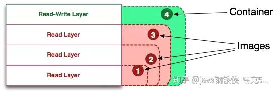
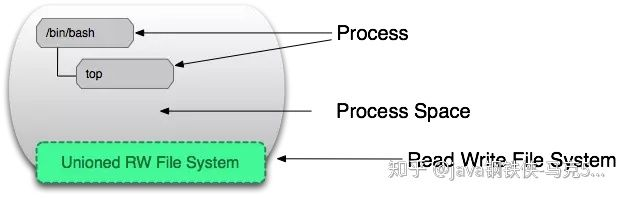
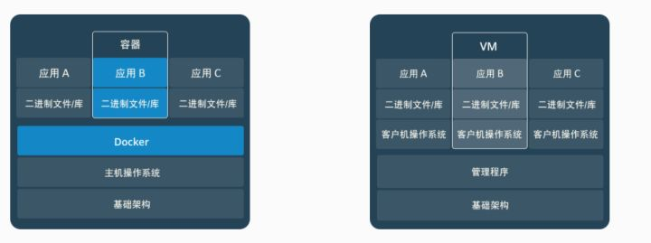

# Docker 相关资料


### 1. 容器和镜像的区别?



+   镜像（Image）就是一堆只读层（read-only layer）的统一视角. Docker 镜像，就相当于是一个 root 文件系统。**Docker 镜像是一个特殊的文件系统，除了提供容器运行时所需的程序、库、资源、配置等文件外，还包含了一些为运行时准备的一些配置参数（如匿名卷、环境变量、用户等）。** 镜像不包含任何动态数据，其内容在构建之后也不会被改变。

    **镜像构建时，会一层层构建，前一层是后一层的基础。每一层构建完就不会再发生改变，后一层上的任何改变只发生在自己这一层。**　比如，删除前一层文件的操作，实际不是真的删除前一层的文件，而是仅在当前层标记为该文件已删除。在最终容器运行的时候，虽然不会看到这个文件，但是实际上该文件会一直跟随镜像。因此，在构建镜像的时候，需要额外小心，每一层尽量只包含该层需要添加的东西，任何额外的东西应该在该层构建结束前清理掉。

+   容器（container）的定义和镜像（image）几乎一模一样，也是一堆层的统一视角，唯一区别在于容器的最上面那一层是可读可写的。

    **容器的实质是进程，但与直接在宿主执行的进程不同，容器进程运行于属于自己的独立的 命名空间。前面讲过镜像使用的是分层存储，容器也是如此。**

    **容器存储层的生存周期和容器一样，容器消亡时，容器存储层也随之消亡。因此，任何保存于容器存储层的信息都会随容器删除而丢失。**

    按照 Docker 最佳实践的要求，**容器不应该向其存储层内写入任何数据** ，容器存储层要保持无状态化。**所有的文件写入操作，都应该使用数据卷（Volume）、或者绑定宿主目录**，在这些位置的读写会跳过容器存储层，直接对宿主(或网络存储)发生读写，其性能和稳定性更高。数据卷的生存周期独立于容器，容器消亡，数据卷不会消亡。因此， **使用数据卷后，容器可以随意删除、重新 run ，数据却不会丢失。**

<center>容器 = 镜像 + 可读层</center>

**Running Container Definition**

一个运行态容器（running container）被定义为一个可读写的统一文件系统加上**隔离的进程空间和包含其中的进程**。



正是文件系统隔离技术使得Docker成为了一个前途无量的技术。一个容器中的进程可能会对文件进行修改、删除、创建，这些改变都将作用于可读写层（read-write layer）。

[1]: http://merrigrove.blogspot.com/2015/10/visualizing-docker-containers-and-images.html	"Visualizing Docker Containers and Images"


### 2. Docker与虚拟机有何不同？

Docker不是虚拟化方法。它依赖于实际实现基于容器的虚拟化或操作系统级虚拟化的其他工具。Docker主要专注于在应用程序容器内自动部署应用程序。应用程序容器旨在打包和运行单个服务，而系统容器则设计为运行多个进程，如虚拟机。因此，Docker被视为容器化系统上的容器管理或应用程序部署工具。

+   与虚拟机不同，容器**不需要引导操作系统内核**，因此可以在不到一秒的时间内创建容器。此功能使基于容器的虚拟化比其他虚拟化方法更加独特和可取。
+   由于基于容器的虚拟化为主机增加了很少或没有开销，因此基于容器的虚拟化具有接近本机的性能
+   对于基于容器的虚拟化，与其他虚拟化不同，不需要其他软件。
+   主机上的所有容器共享主机的调度程序，从而节省了额外资源的需求。
+   与虚拟机映像相比，容器状态（Docker或LXC映像）的大小很小，因此容器映像很容易分发。
+   容器中的资源管理是通过cgroup实现的。Cgroups不允许容器消耗比分配给它们更多的资源。虽然主机的所有资源都在虚拟机中可见，但无法使用。这可以通过在容器和主机上同时运行top或htop来实现。所有环境的输出看起来都很相似。

简单来说： **容器和虚拟机具有相似的资源隔离和分配优势，但功能有所不同，因为容器虚拟化的是操作系统，而不是硬件，因此容器更容易移植，效率也更高。**



传统虚拟机技术是虚拟出一套硬件后，在其上运行一个完整操作系统，在该系统上再运行所需应用进程；

而容器内的应用进程直接运行于宿主的内核，容器内没有自己的内核，而且也没有进行硬件虚拟。因此容器要比传统虚拟机更为轻便.


### 3. 容器内部机制？

每个容器都在自己的命名空间中运行，但使用与所有其他容器完全相同的内核。发生隔离是因为内核知道分配给进程的命名空间，并且在API调用期间确保进程只能访问其自己的命名空间中的资源。容器作为主机操作系统上用户空间中的独立进程运行。

### 4. Docker镜像和层有什么区别？

+   镜像：Docker镜像是由一系列只读层构建的
+   层：每个层代表镜像Dockerfile中的一条指令。

下面的Dockerfile包含四个命令，每个命令都创建一个层。

```dockerfile
FROM ubuntu:15.04
COPY . /app
RUN make /app
CMD python /app/app.py
```

重要的是，每个层只是与之前一层的一组差异层（相同的就不再放到新层中）。

### 4. 如何使用Docker构建与环境无关的系统？

有三个主要功能有助于实现这一目标：

+   数据卷
+   环境变量注入
+   只读文件系统


[1]: <http://www.cocoachina.com/articles/28320>

