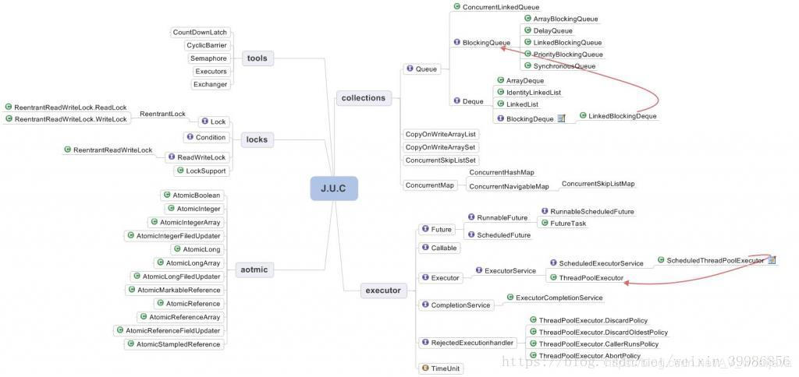
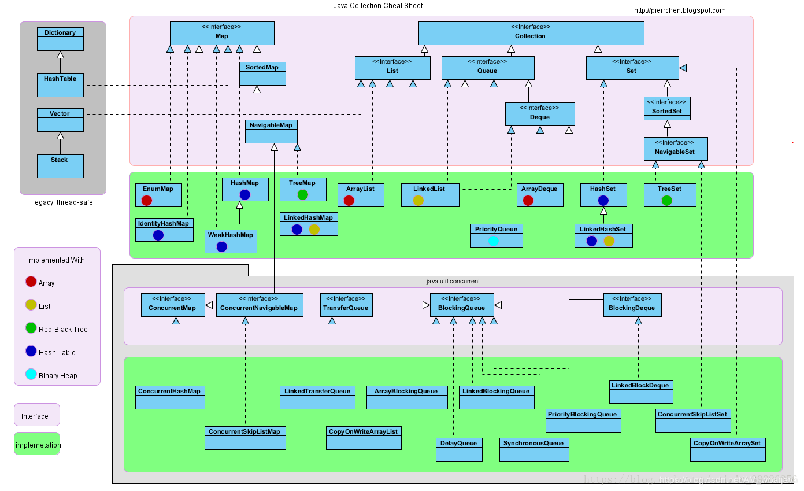
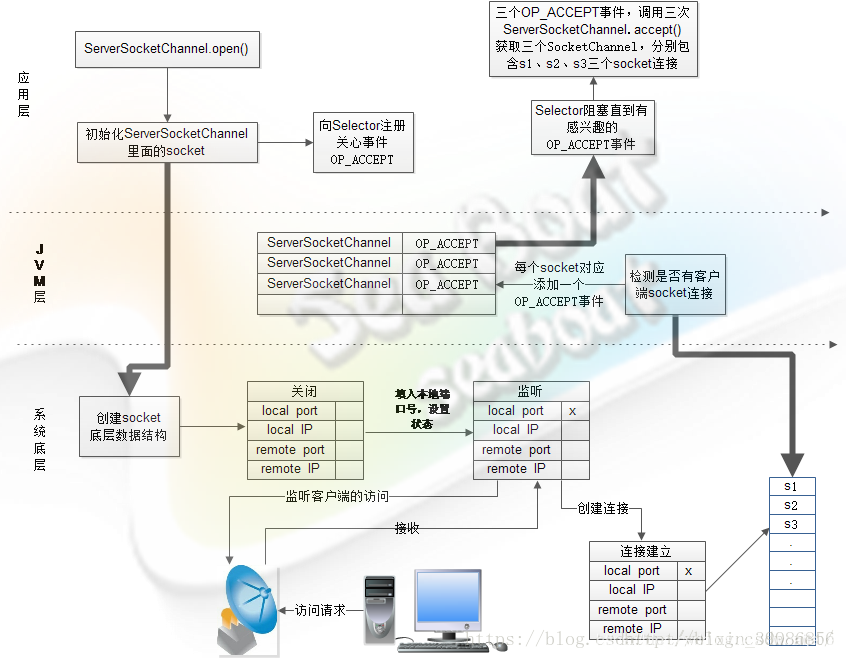

### JUC 简介

在 Java 5.0 提供了java.util.concurrent(简称JUC)包,在此包中增加了在并发编程中很常用的工具类,用于定义类似于线程的自定义子系统,包括线程池, 异步 IO 和 轻量级任务框架; 还提供了设计用于多线程上下文中的 Collection 实现等;

JUC提供的一些实现：

>Atomic : AtomicInteger  原子操作类
>
>Locks : Lock, Condition, ReadWriteLock  可重入读写锁
>
>Collections : Queue, ConcurrentMap 并发集合
>
>Executer : Future, Callable, Executor 线程执行池，异步Future等
>
>Tools : CountDownLatch, CyclicBarrier, Semaphore 减数器，等待器，信号量

java提供了synchonized关键字实现悲观锁机制，以求指令原子性，内存可见性，操作互斥性. 但是synchonized锁机制会导致性能下降，控制的颗粒度也粗，所以JUC的核心理念是不通过重量级的synchonized来解决并发问题。

我个人理解的JUC三大核心是 ：

>   1.volatile 关键字保证内存可见性；
>
>   2.CAS(Compare-And-Swap) 算法 保证数据的原子性;
>
>   3.AQS队列   （Unsafe类的park操作是调用Posix的信号量互斥量 condition，mutex那套来实现）

AQS的内部队列采用的是CLH队列锁模型，CLH队列是由一个一个结点（Node）构成的。Node类中有两个常量SHARE和EXCLUSIVE，顾名思义这两个常量用于表示这个结点支持共享模式还是独占模式，共享模式指的是允许多个线程获取同一个锁而且可能获取成功，独占模式指的是一个锁如果被一个线程持有，其他线程必须等待。多个线程读取一个文件可以采用共享模式，而当有一个线程在写文件时不会允许另一个线程写这个文件，这就是独占模式的应用场景。

找的一张AQS队列

JUC的各种功能都是通过实现自定义sync类继承AQS（AbstractQueuedSynchronizer）类，sync有公平锁，非公平锁；也可以区分为独占sync，共享sync。AQS源码一半好懂一半晦涩，比如 do{                node.prev = pred = pred.prev;            }while(pred.waitStatus >0); 这一段，我也有过空指针疑问，还有比如，为什么要倒序唤醒等等，所以我附上一份个人觉得比较好的AQS源码解读：

>   共享锁：https://www.jianshu.com/p/1161d33fc1d0
>
>   独占锁：https://www.jianshu.com/p/71449a7d01af

