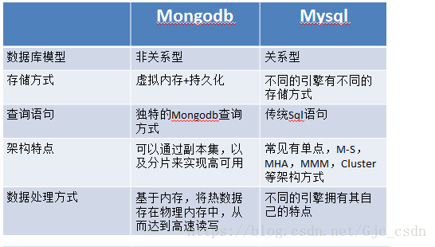

# MongoDb

`MongoDB`是基于分布式文件存储的数据库，由`C++`语言编写。旨在为`WEB`应用提供可扩展的高性能数据存储解决方案,且`MongodDB`是一个介于关系数据库与非关系数据库之间的产品，是非关系型数据库中功能最丰富，最像关系数据库。

### **1：MongoDB的优势有哪些？**

+   面向集合(`Collection`)和文档(`document`)的存储，以JSON格式的文档保存数据。

+   高性能，支持`Document`中嵌入`Document`减少了数据库系统上的I/O操作以及具有完整的索引支持，支持快速查询

+   高效的传统存储方式：支持二进制数据及大型对象

+   高可用性，数据复制集，MongoDB 数据库支持服务器之间的数据复制来提供自动故障转移（`automatic failover`）

+   高可扩展性，分片(`sharding`)将数据分布在多个数据中心, MongoDB支持基于分片键创建数据区域.

+   丰富的查询功能, 聚合管道(`Aggregation Pipeline`)、全文搜索(`Text Search`)以及地理空间查询(`Geospatial Queries`)

+   支持多个存储引擎, WiredTiger存储引、In-Memory存储引擎

    

###  **2：MongoDB 支持哪些数据类型?**

**java类似数据类型：**

| 类型       | 解析                                                         |
| ---------- | ------------------------------------------------------------ |
| `String`   | 字符串。存储数据常用的数据类型。在 `MongoDB` 中，`UTF-8` 编码的字符串才是合法的 |
| `Integer`  | 整型数值。用于存储数值。根据你所采用的服务器，可分为 32 位或 64 位 |
| `Double`   | 双精度浮点值。用于存储浮点值                                 |
| `Boolean`  | 布尔值。用于存储布尔值（真/假）                              |
| `Arrays`   | 用于将数组或列表或多个值存储为一个键                         |
| `Datetime` | 记录文档修改或添加的具体时间                                 |

**MongoDB特有数据类型：**

| 类型                 | 解析                                                         |
| -------------------- | ------------------------------------------------------------ |
| `ObjectId`           | 用于存储文档 `id`,`ObjectId`是基于分布式主键的实现`MongoDB`分片也可继续使用 |
| `Min/Max Keys`       | 将一个值与 BSON（二进制的 JSON）元素的最低值和最高值相对比   |
| `Code`               | 用于在文档中存储 `JavaScript`代码                            |
| `Regular Expression` | 用于在文档中存储正则表达式                                   |
| `Binary Data`        | 二进制数据。用于存储二进制数据                               |
| `Null`               | 用于创建空值                                                 |
| `Object`             | 用于内嵌文档                                                 |

+   缺点

①mongodb不支持事务操作。
②MongoDB没有如MySQL那样成熟的维护工具，这对于开发和IT运营都是个值得注意的地方。

### **3：什么是集合Collection、文档Document,以及与关系型数据库术语类比。**

+   集合`Collection`位于单独的一个数据库MongoDB 文档`Document`集合，它类似关系型数据库（RDBMS）中的表`Table`。一个集合`Collection`内的多个文档`Document`可以有多个不同的字段。通常情况下，集合`Collection`中的文档`Document`有着相同含义。
+   文档`Document`由key-value构成。文档`Document`是动态模式,这说明同一集合里的文档不需要有相同的字段和结构。类似于关系型数据库中table中的每一条记录。
+   与关系型数据库术语类比

| mongodb            | 关系型数据库 |
| ------------------ | ------------ |
| Database           | Database     |
| Collection         | Table        |
| Document           | Record/Row   |
| Filed              | Column       |
| Embedded Documents | Table join   |

### **4：什么是”Mongod“,以及MongoDB命令。**

  `mongod`是处理`MongoDB`系统的主要进程。它处理数据请求，管理数据存储，和执行后台管理操作。当我们运行`mongod`命令意味着正在启动`MongoDB`进程,并且在后台运行。

`MongoDB`命令：

| 命令                                    | 说明               |
| --------------------------------------- | ------------------ |
| use database_name                       | 切换数据库         |
| db.myCollection.find().pretty()         | 格式化打印结果     |
| db.getCollection(collectionName).find() | 修改Collection名称 |

###  **5："Mongod"默认参数有?**

+   传递数据库存储路径，默认是`"/data/db"`
+   端口号 默认是 "27017"

### **6：MySQL和mongodb的区别**

| 形式         | MongoDB                                                      | MySQL                             |
| ------------ | ------------------------------------------------------------ | --------------------------------- |
| 数据库模型   | 非关系型                                                     | 关系型                            |
| 存储方式     |                                                              | 虚拟内存+持久化                   |
| 查询语句     | 独特的MongoDB查询方式                                        | 传统SQL语句                       |
| 架构特点     | 副本集以及分片                                               | 常见单点、M-S、MHA、MMM等架构方式 |
| 数据处理方式 | 基于内存，将热数据存在物理内存中，从而达到高速读写           | 不同的引擎拥有自己的特点          |
| 使用场景     | 事件的记录，内容管理或者博客平台等数据大且非结构化数据的场景 | 适用于数据量少且很多结构化数据    |

### 7：问`mongodb`和`redis`区别以及选择原因

| 形式           | MongoDB                                                      | redis                                                        |
| -------------- | ------------------------------------------------------------ | ------------------------------------------------------------ |
| 内存管理机制   | MongoDB 数据存在内存，由 linux系统 mmap 实现，当内存不够时，只将热点数据放入内存，其他数据存在磁盘 | Redis 数据全部存在内存，定期写入磁盘，当内存不够时，可以选择指定的 LRU 算法删除数据 |
| 支持的数据结构 | MongoDB 数据结构比较单一，但是支持丰富的数据表达，索引       | Redis 支持的数据结构丰富，包括hash、set、list等              |
| 性能           | mongodb依赖内存，TPS较高                                     | Redis依赖内存，TPS非常高。性能上Redis优于MongoDB             |
| 可靠性         | 支持持久化以及复制集增加可靠性                               | Redis依赖快照进行持久化；AOF增强可靠性；增强可靠性的同时，影响访问性能 |
| 数据分析       | mongodb内置数据分析功能（mapreduce）                         | Redis不支持                                                  |
| 事务支持情况   | 只支持单文档事务，需要复杂事务支持的场景暂时不适合           | Redis 事务支持比较弱，只能保证事务中的每个操作连续执行       |
| 集群           | MongoDB 集群技术比较成熟                                     | Redis从3.0开始支持集群                                       |

 **选择原因：**

+   架构简单
+   没有复杂的连接
+   深度查询能力,`MongoDB`支持动态查询。
+   容易调试
+   容易扩展
+   不需要转化/映射应用对象到数据库对象
+   使用内部内存作为存储工作区,以便更快的存取数据。

### **8：如何执行事务/加锁?**

  `mongodb`没有使用传统的锁或者复杂的带回滚的事务,因为它设计的宗旨是轻量,快速以及可预计的高性能.可以把它类比成`mysql mylsam`的自动提交模式. 通过精简对事务的支持,性能得到了提升,特别是在一个可能会穿过多个服务器的系统里.

### **9:更新操作会立刻fsync到磁盘?**

  不会,磁盘写操作默认是延迟执行的.写操作可能在两三秒(默认在60秒内)后到达磁盘，通过 `syncPeriodSecs` 启动参数，可以进行配置.例如,如果一秒内数据库收到一千个对一个对象递增的操作,仅刷新磁盘一次.

### MongoDB索引

**10Q: 索引类型有哪些？**

+   单字段索引(`Single Field Indexes`)
+   复合索引(`Compound Indexes`)
+   多键索引(`Multikey Indexes`)
+   全文索引(`text Indexes`)
+   Hash 索引(`Hash Indexes`)
+   通配符索引(`Wildcard Index`)
+   2dsphere索引(`2dsphere Indexes`)

**11Q：MongoDB在A:{B,C}上建立索引，查询A:{B,C} 和A:{C,B}都会使用索引吗？**

 由于`MongoDB`索引使用`B-tree`树原理，只会在A:{B,C}上使用索引
  

**MongoDB索引详情可看文章**[【**MongoDB系列--轻松应对面试中遇到的MongonDB索引(index)问题**】](https://juejin.im/post/5d41924f5188255d5102e1fd)，**其中包括很多索引的问题：**

+   **创建索引，需要考虑的问题**
+   **索引限制问题**
+   **索引类型详细解析**
+   **索引的种类问题**

### **12：什么是聚合**

  聚合操作能够处理数据记录并返回计算结果。聚合操作能将多个文档中的值组合起来，对成组数据执行各种操作，返回单一的结果。它相当于 `SQ`L 中的 `count(*)` 组合 `group by`。对于 `MongoDB` 中的聚合操作，应该使用`aggregate()`方法。

**详情可查看文章**[【**MongoDB系列--深入理解MongoDB聚合（Aggregation）**】](https://juejin.im/post/5d40482ce51d4561c41fb79e)，**其中包括很多聚合的问题：**

+   **聚合管道（aggregation pipeline）的问题**
+   **Aggregation Pipeline 优化等问题**
+   **Map-Reduce函数的问题**

### MongoDB分片

**13：monogodb 中的分片sharding**

  分片`sharding`是将数据水平切分到不同的物理节点。当应用数据越来越大的时候，数据量也会越来越大。当数据量增长 时，单台机器有可能无法存储数据或可接受的读取写入吞吐量。利用分片技术可以添加更多的机器来应对数据量增加 以及读写操作的要求。

**14Q：分片(Shard)和复制(replication)是怎样工作的?**

 每一个分片(`shard`)是一个分区数据的逻辑集合。分片可能由单一服务器或者集群组成，我们推荐为每一个分片(`shard`)使用集群。

**15Q：如果块移动操作(moveChunk)失败了，我需要手动清除部分转移的文档吗?**

 不需要，移动操作是一致(`consistent`)并且是确定性的(`deterministic`)。

+   一次失败后，移动操作会不断重试。
+   当完成后，数据只会出现在新的分片里(shard)

**16Q：数据在什么时候才会扩展到多个分片(Shard)里?**

 `MongoDB` 分片是基于区域(`range`)的。所以一个集合(`collection`)中的所有的对象都被存放到一个块(`chunk`)中,默认块的大小是 64Mb。当数据容量超过64 Mb，才有可能实施一个迁移，只有当存在不止一个块的时候，才会有多个分片获取数据的选项。

**17Q：更新一个正在被迁移的块（Chunk）上的文档时会发生什么？**

 更新操作会立即发生在旧的块（Chunk）上，然后更改才会在所有权转移前复制到新的分片上。

**18Q：如果一个分片（Shard）停止或很慢的时候，发起一个查询会怎样？**

如果一个分片停止了，除非查询设置了 “`Partial`” 选项，否则查询会返回一个错误。如果一个分片响应很慢，`MongoDB` 会等待它的响应。

### MongoDB复制集

**19Q：MongoDB副本集实现高可用的原理**

 `MongoDB` 使用了其复制(`Replica Set`)方案，实现自动容错机制为高可用提供了基础。目前，`MongoDB` 支持两种复制模式：

+   `Master` / `Slave` ，主从复制，角色包括 `Master` 和 `Slave` 。
+   `Replica Set` ，复制集复制，角色包括 `Primary` 和 `Secondary` 以及 `Arbiter` 。(**生产环境必选**)

**20Q：什么是master或primary？**

 副本集只能有一个主节点能够确认写入操作来接收所有写操作，并记录其操作日志中的数据集的所有更改(记录在oplog中)。在集群中，当主节点（`master`）失效，Secondary节点会变为`master`

**21Q：什么是Slave或Secondary？**

 复制主节点的oplog并将oplog记录的操作应用于其数据集，如果主节点宕机了，将从符合条件的从节点选举选出新的主节点。

**22Q:什么是Arbiter？**

 仲裁节点不维护数据集。 仲裁节点的目的是通过响应其他副本集节点的心跳和选举请求来维护副本集中的仲裁

**23Q：复制集节点类型有哪些？**

+   优先级0型(`Priority 0`)节点
+   隐藏型(`Hidden`)节点
+   延迟型(`Delayed`)节点
+   投票型(`Vote`)节点以及不可投票节点

**24Q:启用备份故障恢复需要多久?**

  从备份数据库声明主数据库宕机到选出一个备份数据库作为新的主数据库将花费10到30秒时间.这期间在主数据库上的操作将会失败–包括写入和强一致性读取(`strong consistent read`)操作.然而,你还能在第二数据库上执行最终一致性查询(`eventually consistent query`)(在`slaveok`模式下),即使在这段时间里.

**MongoDB复制详解分析可查看文章**[【**MongoDB系列-解决面试中可能遇到的MongoDB复制集（replica set）问题**】](https://juejin.im/post/5d492ab9f265da03ad1437ed)

### 25Q：`raft`选举过程，投票规则？

**选举过程：**

  当系统启动好之后，初始选举后系统由1个`Leader`和若干个`Follower`角色组成。然后突然由于某个异常原因，`Leader`服务出现了异常，导致`Follower`角色检测到和`Leader`的上次RPC更新时间超过给定阈值时间时。此时`Followe`r会认为`Leader`服务已出现异常，然后它将会发起一次新的`Leader`选举行为，同时将自身的状态从`Follower`切换为`Candidate`身份。随后请求其它`Follower`投票选择自己。

**投票规则：**

+   当一个候选人获得了同一个任期号内的大多数选票，就成为领导人。
+   每个节点最多在一个任期内投出一张选票。并且按照先来先服务的原则。
+   一旦候选人赢得选举，立刻成为领导，并发送心跳维持权威，同时阻止新领导人的诞生

**可查看文章**[【**通俗易懂的Paxos算法-基于消息传递的一致性算法**】](https://juejin.im/post/5d122a306fb9a07ee9587e71)

### **26Q：在哪些场景使用MongoDB?**

**规则：** 如果业务中存在大量复杂的事务逻辑操作，则不要用`MongoDB`数据库；在处理非结构化 / 半结构化的大数据使用`MongoDB`，操作的数据类型为动态时也使用`MongoDB`，比如：

+   内容管理系统，切面数据、日志记录
+   移动端`Apps`：`O2O`送快递骑手、快递商家的信息（包含位置信息）
+   数据管理，监控数据

