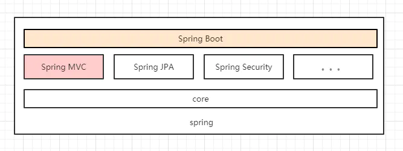
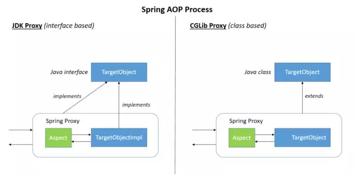
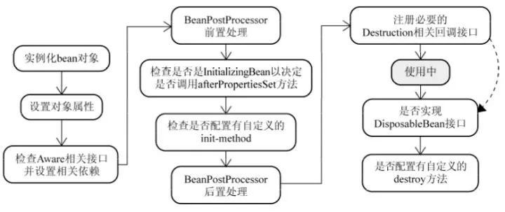
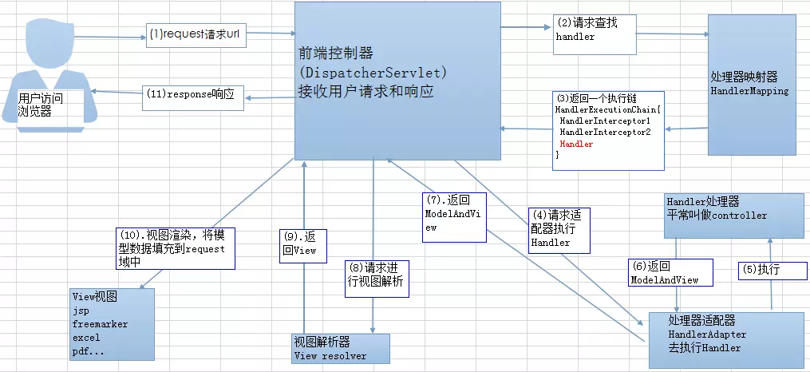

# Spring 问题


## 基础概念

### 1. 什么是 Spring 框架?

Spring 是一种轻量级开发框架，旨在提高开发人员的开发效率以及系统的可维护性。

Spring，一般指代的是Spring Framework，它是一个开源的应用程序框架，提供了一个简易的开发方式，**通过这种开发方式，将避免那些可能致使代码变得繁杂混乱的大量的业务/工具对象，说的更通俗一点就是由框架来帮你管理这些对象，包括它的创建，销毁等**，比如基于Spring的项目里经常能看到的`Bean`，它代表的就是由Spring管辖的对象。

它是很多模块的集合，使用这些模块可以很方便地协助我们进行开发。包括：

+   **核心技术** ：依赖注入(DI)，AOP，事件(events)，资源，i18n，验证，数据绑定，类型转换，SpEL。

+   **测试** ：模拟对象，TestContext框架，Spring MVC 测试，WebTestClient。

+   **数据访问** ：事务，DAO支持，JDBC，ORM，编组XML。

+   **Web支持** : Spring MVC和Spring WebFlux Web框架。

+   **集成** ：远程处理，JMS，JCA，JMX，电子邮件，任务，调度，缓存。

+   **语言** ：Kotlin，Groovy，动态语言。

    

### 列举一些重要的Spring模块？

**Spring Core：** 基础,可以说 Spring 其他所有的功能都需要依赖于该类库。主要提供 IOC 依赖注入功能。

**Spring  Aspects ** ： 该模块为与AspectJ的集成提供支持。

**Spring AOP** ：提供了面向方面的编程实现。

**Spring JDBC** : Java数据库连接。

**Spring JMS** ：Java消息服务。

**Spring ORM** : 用于支持Hibernate等ORM工具。

**Spring Web** : 为创建Web应用程序提供支持。

**Spring Test** : 提供了对 JUnit 和 TestNG 测试的支持。


### 2. [Spring和SpringBoot比较](https://www.jianshu.com/p/ffe5ebe17c3a)

`Spring Boot`只是`Spring`本身的扩展，使开发，测试和部署更加方便，遵循的也是**约定优于配置**原则，它消除了设置`Spring`应用程序所需的`XML配置`，为更快，更高效的开发生态系统铺平了道路。


### 3. 什么是Spring MVC？它解决了什么问题？

Spring MVC是Spring的一部分，Spring 出来以后，大家觉得很好用，于是按照这种模式设计了一个 MVC框架（一些用Spring 解耦的组件），**主要用于开发WEB应用和网络接口，它是Spring的一个模块，通过Dispatcher Servlet, ModelAndView 和 View Resolver，让应用开发变得很容易**，一个典型的Spring MVC应用开发分为下面几步：

+   首先通过配置文件声明Dispatcher Servlet
+   通过配置文件声明servlet详情，如MVC resource，data source，bean等
+   若需添加其它功能，如security，则需添加对应配置
+   增加业务代码，如controller，service，model等，最后生成war包，通过容器进行启动

### 4. Spring，Spring MVC，Spring Boot 三者比较

Spring 就像一个大家族，有众多衍生产品例如 Boot，Security，JPA等等。但他们的基础都是Spring 的 IOC 和 AOP，IOC提供了依赖注入的容器，而AOP解决了面向切面的编程，然后在此两者的基础上实现了其他衍生产品的高级功能；Spring MVC是基于 Servlet 的一个 MVC 框架，主要解决 WEB 开发的问题，因为 Spring 的配置非常复杂，各种xml，properties处理起来比较繁琐。于是为了简化开发者的使用，Spring社区创造性地推出了Spring Boot，它遵循约定优于配置，极大降低了Spring使用门槛，但又不失Spring原本灵活强大的功能，下面用一张图来描述三者的关系：




## 核心技术

+   Java反射原理
+   动态代理和责任链模式
+   IOC 和DI原理
+   AOP原理
+   Spring Bean 的流程
+   Spring MVC处理流程
+   注解原理
+   MyBatis原理


### 谈谈自己对于 Spring IoC 和 AOP 的理解

### IoC

IoC（Inverse of Control:控制反转）是一种**设计思想**，就是 **将原本在程序中手动创建对象的控制权，交由Spring框架来管理。**  IoC 在其他语言中也有应用，并非 Spirng 特有。 **IoC 容器是 Spring 用来实现 IoC 的载体，  IoC 容器实际上就是个Map（key，value）,Map 中存放的是各种对象。**

将对象之间的相互依赖关系交给 IOC 容器来管理，并由 IOC 容器完成对象的注入。这样可以很大程度上简化应用的开发，把应用从复杂的依赖关系中解放出来。  **IOC 容器就像是一个工厂一样，当我们需要创建一个对象的时候，只需要配置好配置文件/注解即可，完全不用考虑对象是如何被创建出来的。** 在实际项目中一个 Service 类可能有几百甚至上千个类作为它的底层，假如我们需要实例化这个 Service，你可能要每次都要搞清这个 Service 所有底层类的构造函数，这可能会把人逼疯。如果利用 IOC 的话，你只需要配置好，然后在需要的地方引用就行了，这大大增加了项目的可维护性且降低了开发难度。

Spring 时代我们一般通过 XML 文件来配置 Bean，后来开发人员觉得 XML 文件来配置不太好，于是 SpringBoot 注解配置就慢慢开始流行起来。

推荐阅读：[www.zhihu.com/question/23…](https://www.zhihu.com/question/23277575/answer/169698662)

**Spring IOC的初始化过程：** 


IOC源码阅读

+   [javadoop.com/post/spring…](https://javadoop.com/post/spring-ioc)

### AOP

AOP(Aspect-Oriented Programming:面向切面编程)能够将那些与业务无关，**却为业务模块所共同调用的逻辑或责任（例如事务处理、日志管理、权限控制等）封装起来**，便于**减少系统的重复代码**，**降低模块间的耦合度**，并**有利于未来的可拓展性和可维护性**。

**Spring AOP就是基于动态代理的**，如果要代理的对象，实现了某个接口，那么Spring AOP会使用**JDK Proxy**，去创建代理对象，而对于没有实现接口的对象，就无法使用 JDK Proxy 去进行代理了，这时候Spring AOP会使用**Cglib** ，这时候Spring AOP会使用 **Cglib** 生成一个被代理对象的子类来作为代理，如下图所示：





当然你也可以使用 AspectJ ,Spring AOP 已经集成了AspectJ  ，AspectJ  应该算的上是 Java 生态系统中最完整的 AOP 框架了。

使用 AOP 之后我们可以把一些通用功能抽象出来，在需要用到的地方直接使用即可，这样大大简化了代码量。我们需要增加新功能时也方便，这样也提高了系统扩展性。日志功能、事务管理等等场景都用到了 AOP 。


### Spring AOP 和 AspectJ AOP 有什么区别？

**Spring AOP 属于运行时增强，而 AspectJ 是编译时增强。** Spring AOP 基于代理(Proxying)，而 AspectJ 基于字节码操作(Bytecode Manipulation)。

Spring AOP 已经集成了 AspectJ  ，AspectJ  应该算的上是 Java 生态系统中最完整的 AOP 框架了。AspectJ  相比于 Spring AOP 功能更加强大，但是 Spring AOP 相对来说更简单，

如果我们的切面比较少，那么两者性能差异不大。但是，当切面太多的话，最好选择 AspectJ ，它比Spring AOP 快很多。


### Spring 中的 bean 的作用域有哪些?

singleton : 唯一 bean 实例，Spring 中的 bean 默认都是单例的。

prototype : 每次请求都会创建一个新的 bean 实例。

request : 每一次HTTP请求都会产生一个新的bean，该bean仅在当前HTTP request内有效。

session : 每一次HTTP请求都会产生一个新的 bean，该bean仅在当前 HTTP session 内有效。

global-session： 全局session作用域，仅仅在基于portlet的web应用中才有意义，Spring5已经没有了。Portlet是能够生成语义代码(例如：HTML)片段的小型Java Web插件。它们基于portlet容器，可以像servlet一样处理HTTP请求。但是，与 servlet 不同，每个 portlet 都有不同的会话


### Spring 中的单例 bean 的线程安全问题了解吗？

大部分时候我们并没有在系统中使用多线程，所以很少有人会关注这个问题。单例 bean 存在线程问题，主要是因为当多个线程操作同一个对象的时候，对这个对象的非静态成员变量的写操作会存在线程安全问题。

常见的有两种解决办法：

1.  在Bean对象中尽量避免定义可变的成员变量（不太现实）。
2.  在类中定义一个ThreadLocal成员变量，将需要的可变成员变量保存在 ThreadLocal 中（推荐的一种方式）。


### Spring 中的 bean 生命周期?



Bean 容器找到配置文件中 Spring Bean 的定义。

Bean 容器利用 Java Reflection API 创建一个Bean的实例。

如果涉及到一些属性值 利用 `set()`方法设置一些属性值。

如果 Bean 实现了 `BeanNameAware` 接口，调用 `setBeanName()`方法，传入Bean的名字。

如果 Bean 实现了 `BeanClassLoaderAware` 接口，调用 `setBeanClassLoader()`方法，传入 `ClassLoader`对象的实例。

如果Bean实现了 `BeanFactoryAware` 接口，调用 `setBeanClassLoader()`方法，传入 `ClassLoade` r对象的实例。

与上面的类似，如果实现了其他 `*.Aware`接口，就调用相应的方法。

如果有和加载这个 Bean 的 Spring 容器相关的 `BeanPostProcessor` 对象，执行`postProcessBeforeInitialization()` 方法

如果Bean实现了`InitializingBean`接口，执行`afterPropertiesSet()`方法。

如果 Bean 在配置文件中的定义包含  init-method 属性，执行指定的方法。

如果有和加载这个 Bean的 Spring 容器相关的 `BeanPostProcessor` 对象，执行`postProcessAfterInitialization()` 方法

当要销毁 Bean 的时候，如果 Bean 实现了 `DisposableBean` 接口，执行 `destroy()` 方法。

当要销毁 Bean 的时候，如果 Bean 在配置文件中的定义包含 destroy-method 属性，执行指定的方法。


### SpringMVC 工作原理了解吗?




**流程说明（重要）：**

1.  客户端（浏览器）发送请求，直接请求到 `DispatcherServlet`。
2.  `DispatcherServlet` 根据请求信息调用 `HandlerMapping`，解析请求对应的 `Handler`。
3.  解析到对应的 `Handler`（也就是我们平常说的 `Controller` 控制器）后，开始由 `HandlerAdapter` 适配器处理。
4.  `HandlerAdapter` 会根据 `Handler`来调用真正的处理器开处理请求，并处理相应的业务逻辑。
5.  处理器处理完业务后，会返回一个 `ModelAndView` 对象，`Model` 是返回的数据对象，`View` 是个逻辑上的 `View`。
6.  `ViewResolver` 会根据逻辑 `View` 查找实际的 `View`。
7.  `DispaterServlet` 把返回的 `Model` 传给 `View`（视图渲染）。
8.  把 `View` 返回给请求者（浏览器）


### Spring 框架中用到了哪些设计模式？

关于下面一些设计模式的详细介绍，可以看笔主前段时间的原创文章[《面试官:“谈谈Spring中都用到了那些设计模式?”。》](https://mp.weixin.qq.com/s?__biz=Mzg2OTA0Njk0OA==&mid=2247485303&idx=1&sn=9e4626a1e3f001f9b0d84a6fa0cff04a&chksm=cea248bcf9d5c1aaf48b67cc52bac74eb29d6037848d6cf213b0e5466f2d1fda970db700ba41&token=255050878&lang=zh_CN#rd) 。

+   **工厂设计模式** : Spring使用工厂模式通过 `BeanFactory`、`ApplicationContext` 创建 bean 对象。
+   **代理设计模式** : Spring AOP 功能的实现。
+   **单例设计模式** : Spring 中的 Bean 默认都是单例的。
+   **模板方法模式** : Spring 中 `jdbcTemplate`、`hibernateTemplate` 等以 Template 结尾的对数据库操作的类，它们就使用到了模板模式。
+   **包装器设计模式** : 我们的项目需要连接多个数据库，而且不同的客户在每次访问中根据需要会去访问不同的数据库。这种模式让我们可以根据客户的需求能够动态切换不同的数据源。
+   **观察者模式:** Spring 事件驱动模型就是观察者模式很经典的一个应用。
+   **适配器模式** :Spring AOP 的增强或通知(Advice)使用到了适配器模式、spring MVC 中也是用到了适配器模式适配`Controller`。

### @Component 和 @Bean 的区别是什么？

作用对象不同: `@Component` 注解作用于类，而`@Bean`注解作用于方法。

`@Component`通常是通过类路径扫描来自动侦测以及自动装配到Spring容器中（我们可以使用 `@ComponentScan` 注解定义要扫描的路径从中找出标识了需要装配的类自动装配到 Spring 的 bean 容器中）。`@Bean` 注解通常是我们在标有该注解的方法中定义产生这个 bean,`@Bean`告诉了Spring这是某个类的示例，当我需要用它的时候还给我。

`@Bean` 注解比 `Component` 注解的自定义性更强，而且很多地方我们只能通过 `@Bean` 注解来注册bean。比如当我们引用第三方库中的类需要装配到 `Spring`容器时，则只能通过 `@Bean`来实现。

`@Bean`注解使用示例：

```java
@Configuration
public class AppConfig {
    @Bean
    public TransferService transferService() {
        return new TransferServiceImpl();
    }

}
复制代码
```

上面的代码相当于下面的 xml 配置

```java
<beans>
    <bean id="transferService" class="com.acme.TransferServiceImpl"/>
</beans>
复制代码
```

下面这个例子是通过 `@Component` 无法实现的。

```java
@Bean
public OneService getService(status) {
    case (status)  {
        when 1:
                return new serviceImpl1();
        when 2:
                return new serviceImpl2();
        when 3:
                return new serviceImpl3();
    }
}
```


### 将一个类声明为Spring的 bean 的注解有哪些?

我们一般使用 `@Autowired` 注解自动装配 bean，要想把类标识成可用于 `@Autowired` 注解自动装配的 bean 的类,采用以下注解可实现：

+   `@Component` ：通用的注解，可标注任意类为 `Spring` 组件。如果一个Bean不知道属于拿个层，可以使用`@Component` 注解标注。
+   `@Repository` : 对应持久层即 Dao 层，主要用于数据库相关操作。
+   `@Service` : 对应服务层，主要涉及一些复杂的逻辑，需要用到 Dao层。
+   `@Controller` : 对应 Spring MVC 控制层，主要用户接受用户请求并调用 Service 层返回数据给前端页面。


