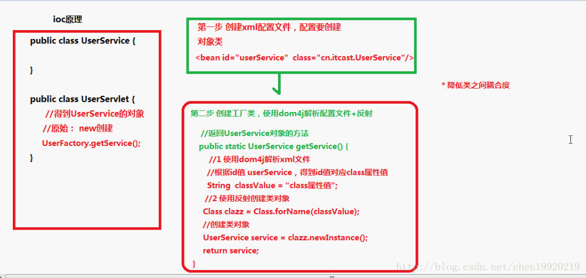
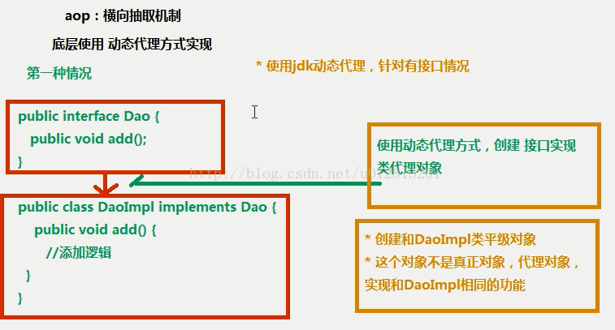
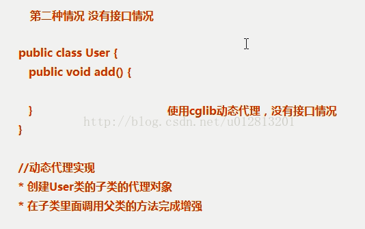

### Spring boot 和 Spring的联系和区别

Spring提供了很多轻量级应用开发实践的工具集合，这些工具集以接口、抽象类、或工具类的形式存在于Spring中。通过使用这些工具集，可以实现应用程序与各种开源技术及框架间的友好整合。比如有关jdbc封装的数据访问工具Spring JDBC，有关编写单元测试的spring test包以及spring-mock，有关访问动态脚本语言的Spring Script，另外还有发送邮件的工具Spring Mail、日程及任务处理工具Spring scheduling等。 可以这么说，大多数企业级应用开发中经常涉及到的一些通用的问题，都可以通过Spring提供的一些实用工具包轻松解决.

Ioc 通过Spring配置来创建对象，而不是new的方式

1.Ioc底层原理

（1）xml配置文件

（2）dom4j解析

（3）工厂设计模式

（4）反射

2.Ioc和DI的区别：

（1）Ioc：控制反转，把创建对象交给Spring进行配置

（2）DI：依赖注入，向类里面的属性中设置值

（3）二者关系：DI不能单独存在，要在Ioc基础之上来完成操作，即要先创建对象才能注入属性值。

控制反转（IoC）与依赖注入（DI）是同一个概念，引入IOC的目的：（1）脱开、降低类之间的耦合；（2）倡导面向接口编程、实施依赖倒换原则； （3）提高系统可插入、可测试、可修改等特性。

### DI 依赖注入

依赖注入的三种方式：（1）接口注入（2）Construct注入（3）Setter注入

二、Aop：面向切面，扩展功能时不通过源代码，横向抽取机制。

AOP全名Aspect-Oriented Programming，中文直译为面向切面(方面)编程，当前已经成为一种比较成熟的编程思想，可以用来很好的解决应用系统中分布于各个模块的交叉关注点问题。在轻量级的J2EE中应用开发中，使用AOP来灵活处理一些具有横切性质的系统级服务，如事务处理、安全检查、缓存、对象池管理等，已经成为一种非常适用的解决方案。 AOP中比较重要的概念有：Aspect、JoinPoint、PonitCut、Advice、Introduction、Weave、Target Object、Proxy Object等

引介（Introduction）是指给一个现有类添加方法或字段属性，引介还可以在不改变现有类代码的情况下，让现有的Java类实现新的接口，或者为其指定一个父类从而实现多重继承。相对于增强(Advice)可以动态改变程序的功能或流程来说，引介(Introduction)则用来改变一个类的静态结构。比如我们可以让一个现有为实现java.lang.Cloneable接口，从而可以通过clone()方法复制这个类的实例。

拦截器是用来实现对连接点进行拦截，从而在连接点前或后加入自定义的切面模块功能。在大多数JAVA的AOP框架实现中，都是使用拦截器来实现字段访问及方法调用的拦截(interception)。所用作用于同一个连接点的多个拦截器组成一个连接器链(interceptor chain)，链接上的每个拦截器通常会调用下一个拦截器。Spring AOP及JBoos AOP实现都是采用拦截器来实现的。

面向对象编程（OOP）解决问题的重点在于对具体领域模型的抽象，而面向切面编程（AOP）解决问题的关键则在于对关注点的抽象。也就是说，系统中对于一些需要分散在多个不相关的模块中解决的共同问题，则交由AOP来解决；AOP能够使用一种更好的方式来解决OOP不能很好解决的横切关注点问题以及相关的设计难题来实现松散耦合。因此，面向方面编程 (AOP) 提供另外一种关于程序结构的思维完善了OOP，是OOP的一种扩展技术，弥补补了OOP的不足。

底层使用动态代理方式---增强方法

具体分两种情况：

（1）有接口的情况：创建接口的实现类的代理对象，jdk动态代理

（2）没有接口的情况：创建User类的子类的代理对象，cglib动态代理。子类可以通过super调用父类方法

增强：before，after，（前置，后置，异常，最终，环绕增强）

相关注解：@Aspect ,@Before,@After,@