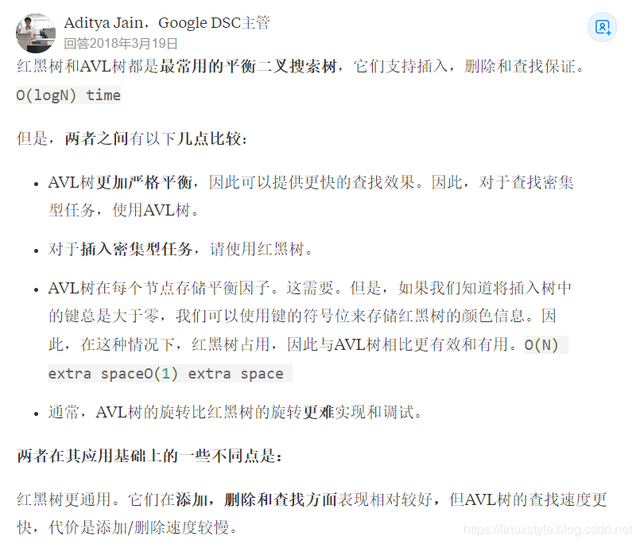

二叉树：解决的是线性表插入慢，链表查找慢的问题，是一种这样的方法。时间复杂度介于对数级和线性级之间。当是完全的平衡二叉树时，时间复杂度是对数级，当时完全的不平衡二叉树时，即已经退化为链表，是线性级。单纯的二叉树只是一个概念，并没有实际应用场景。

二叉查找树：又名二叉排序树，二叉搜索树。如果存在左子树，那么左子树上所有节点均小于根节点，如果存在右子树，那么右子树上所有节点均大于根节点。并且，左右子树也都是二叉查找树。二叉查找树的高度决定了效率。在某些情况下，比如说待插入的数据已经有序，那么会造成二叉查找树退化为链表。可以通过随机化建立二叉查找树的方式尽量避免上述情况。但是，经过多次的删除操作，依然会严重破坏二叉查找树的平衡性。比如，当删除节点时，我们往往是利用该节点的后继来代替节点本身，多次累积，会造成左重右轻。所以，二叉查找树也只是一个概念， 并不存在实际应用。

二叉平衡树：这个有用。大致思路是通过设置一系列规则，在每次插入、删除节点后，对树进行变化，使其永远保持平衡。包括AVL树、红黑树、B树、B+树等。时间复杂度可以维持在对数级。

+   AVL树：通过旋转操作实现自平衡。**windows对进程地址空间的管理通过avl树实现**。

+   红黑树：stl中set和map，linux中ext3文件管理系统，通过红黑树实现。多用于内部排序，即所有数据都可以读入内存，此时需要内存足够大。插入快，删除快，

+   B树：多用于数据量太大，不能一次性完全读入内存，大部分数据都在磁盘上。每次把B树的一块读入内存。当数据量较小时，可以全部读入内存中，红黑树的时间复杂度优于B树。当数据量大，无法一次性读入内存时，B树的时间复杂度优于红黑树，因为可以减少磁盘操作次数。与红黑树相比，B树之所以能够减少磁盘的读写次数，原因是B树的每个节点可以有多于2个子节点，这样的话，会大大降低树的高度。磁盘的读取次数，由树的高度决定，成正比。B树所有叶子结点都出现在同一层，叶子结点不包含任何关键字信息。

+   B+树：B+树为B树的变形结构，为大多数数据库或文件系统的存储而设计。与B树相反，B+树的所有叶子结点包含所有关键字信息。

    与B树相比，B+树的磁盘读写代价更低，由于B+树的非叶子结点中不含有关键字信息，造成每一个内部节点相对来说更小，当内存有限时，可以读取到比B树更多的关键字信息，从而减少磁盘读写次数。

    B+树的查询效率更高。由于非终结点并不是最终指向文件内容的结点，而只是叶子结点中关键字的索引。所以任何关键字的查找必须走一条从根结点到叶子结点的路。所有关键字查询的路径长度相同，导致每一个数据的查询效率相当，更稳定。

    数据库索引采用B+树的主要原因是 B树在提高了磁盘IO性能的同时并没有解决元素遍历的效率低下的问题，因为B树的数据存在于各个节点中，会出现跨层访问的情况。正是为了解决这个问题，B+树应运而生。B+树的所有数据都存在于叶子结点，叶子结点天然有序，即左侧的叶子结点小于右侧的叶子结点。并且叶子结点之间通过指针相连，可以理解为所有叶子结点构成一个链表。只要遍历叶子节点就可以实现整棵树的遍历。而且在数据库中基于范围的查询是非常频繁的，并且可能会出现多个结果的情况，比如select语句可以选择多条数据，而B树不支持这样的操作（或者说效率太低）。

