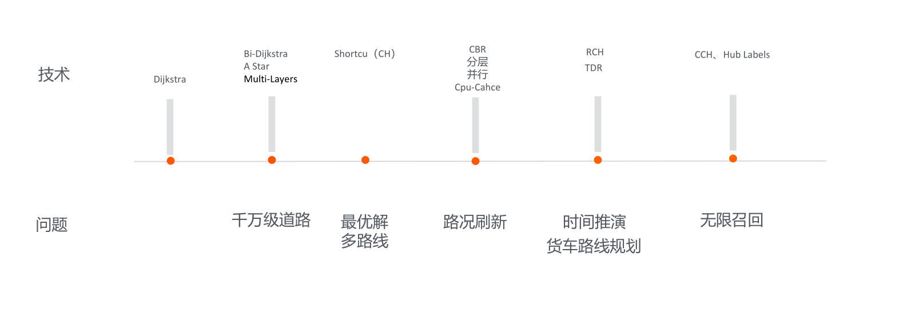

### 路径规划技术演进

如上图所示，竖条为路径规划技术的演进历程。Dijkstra为路径规划最经典的算法，也作为后续所有算法的基石。在求最短距离时它是最经典的算法，但是在中国的路径规划或者全球的路径规划中并不适用，因为中国有四千多万条路，假如计算从西藏到黑龙江的路程，在计算机寻址中可能需要遍历几千万次，根据计算机的性能不可能在很短的时间内得出结果，可能需要等待三分钟的时间。这时，需要对其进行优化，并且找到技术的突破点。前人也提供了一些例子，例如Bi-Dijkstra，与Dijkstra相比，Bi-Dijkstra的搜索空间是一个椭圆，而Dijkstra的搜索空间是一个圆。

Dijkstra可以理解为是在不停的寻找最短的路线，有可能最短的路在边上就会走出范围。而A Star是设定了一个方向，必须沿着向终点的方向走，同时增加一个参数使得提高性能。

Multi-Layers是指将道路进行分层，分为底层路网和高层路网。方式是从底层路网到高层路网的升级，比如从村道上升到县道，再从县道上升到国道，直到上升到高速公路。使用一种减枝的方法使得路径规划查找的数目更少，性能更快。直到2010年还一直使用这种方法。此方法解决了性能问题，实现了在几秒钟之内能够提供给用户一条路线。同时也带来了最优路线的选取问题。

CH算法可以理解为全国的路网是由很多条路、边和节点组成的，利用计算机缓存的原理，将两个点之间的距离缓存下来。算法主要是将全国任意两个点之间的距离预先的计算出来，需要时可以通过查找得到，这样做可以减少遍历的边数，使得性能得到极大的提升。大概几毫秒就可以得到任何两点的路线。但是也存在新的问题，实时的关注路况的动态变化是必要的，比如道路拥堵问题。

CBR算法是指道路进行区域化。将全国化分为很多个区域，比如区域可以分为M个入口和N个出口，将M个入口和N个出口的最短距离和最短时间计算出来并且进行缓存。这样就可以找到一条从M1到N3的最短距离。其主要思路是分层，一个省作为一个区域或者一个市作为一个区域视为一层，另一层进行聚合变成几个省或几个市为一个区域，每一层的结果都是递归的。CH算法是一个线性算法，无法实现并行，而CBR则不同，是可以并行运算的，从而可以节约时间。

Cpu-Cahce 是为了设计精巧的数据结构、达到性能的最优化而设计的。随着用户的不断需求，中国的限行问题对时间推衍有着很大的约束，时间推衍问题也是必需要解决的。

高德实现了TDR算法，在业界内处于领先位置。针对对于货车的路径规划是比较复杂的，因为货车的车型需要避让很多的限高杆和限重路段。目前，如何用一套算法解决上述问题，高德提出了RCH算法。