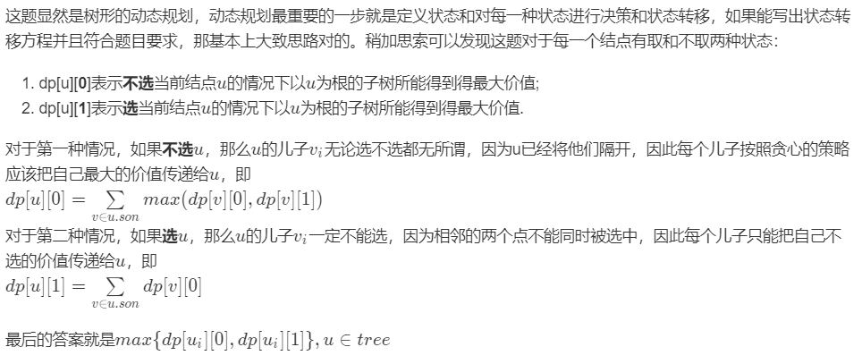

# 动态规划试题汇总


#### [198. 打家劫舍](https://leetcode-cn.com/problems/house-robber/)

```java
class Solution {
    public int rob(int[] nums) {
        int len = nums.length;
        if (len == 0)  return 0;
        if (len == 1)  return nums[0];

        // dp[i][0]：区间 [0, i] 里接受预约请求，并且下标为 i 的这一天不接受预约的最大时长
        // dp[i][1]：区间 [0, i] 里接受预约请求，并且下标为 i 的这一天接受预约的最大时长
        int[][] dp = new int[len][2];
        dp[0][0] = 0;
        dp[0][1] = nums[0];

        for (int i = 1; i < len; i++) {
            dp[i][0] = Math.max(dp[i - 1][0], dp[i - 1][1]);
            dp[i][1] = dp[i - 1][0] + nums[i];
        }
        return Math.max(dp[len - 1][0], dp[len - 1][1]);
    }
}
```

参考 <https://leetcode-cn.com/problems/the-masseuse-lcci/solution/dong-tai-gui-hua-by-liweiwei1419-8/>

#### [213. 打家劫舍 II](https://leetcode-cn.com/problems/house-robber-ii/)

```java
class Solution {
    public int rob(int[] nums) {
        int len = nums.length;
        if(len == 0) return 0;
        if(len == 1) return nums[0];
        // 至少有两间房屋
        return Math.max(rob(nums, 0, len-1), rob(nums, 1, len));     
    }

    public int rob(int[] nums, int left, int right){
        int len = right -left;
        if(len == 1) return nums[left]; // 如果只有一个房屋
        
        int[] dp = new int[len];
        dp[0] = nums[left];
        dp[1] = Math.max(dp[0], nums[left + 1]); 
        
        for(int i = 2; i < len; i++){
            dp[i] = Math.max(dp[i-1], dp[i-2] + nums[i+left]);
        }
        return Math.max(dp[len - 1], dp[len - 2]);

    }
}
```


#### [337. 打家劫舍 III](https://leetcode-cn.com/problems/house-robber-iii/)



```Java
class Solution {
    public int rob(TreeNode root) {
        int[] res = robHelp(root);
        return Math.max(res[0], res[1]);
    }
    public int[] robHelp(TreeNode root){
        if(root == null) return new int[2];
        int[] res = new int[2];

        int[] left = robHelp(root.left);
        int[] right = robHelp(root.right);

        // 1 表示选中子节点
        res[1] = Math.max(left[0],left[1]) + Math.max(right[0],right[1]); 
        // 0 选中父节点
        res[0] = root.val + right[1] + left[1];
        return res;
    }
}

// 暴力递归
class Solution {
    public int rob(TreeNode root) {
        if(root == null) return 0;
        int sum = root.val;
        if(root.left != null){
            sum += rob(root.left.left) + rob(root.left.right);
        } 
        if(root.right != null){
            sum += rob(root.right.left) + rob(root.right.right);
        }
        return Math.max(sum, rob(root.left) + rob(root.right));
    }
}
```

>   参考链接

[0] <https://labuladong.gitbook.io/algo/dong-tai-gui-hua-xi-lie/qiang-fang-zi>


```java
class Solution {
    // 动态规划
    public int maxSubArray(int[] nums) {
        if (nums == null || nums.length == 0) return 0;
        int ans = 0;

        // 1. 状态定义
        // dp[i] 表示前 i 个元素的最大连续子数组的和
        int[] dp = new int[nums.length];

        // 2. 状态初始化，数组中第一个元素的最大和就是第一个元素值
        dp[0] = nums[0];
        ans = nums[0];

        // 3. 状态转移
        // 转移方程：dp[i] = max(dp[i - 1], 0) + nums[i]
        //  dp 当前元素的值等于前一个元素值和 0 的最大值再加上 nums[i]
        for (int i = 1; i < nums.length; i++) {
            dp[i] = Math.max(dp[i - 1], 0) + nums[i];
            // 更新最大和
            ans = Math.max(ans, dp[i]);
        }

        return ans;
    }
}

// 改进版本
class Solution {
    public int maxSubArray(int[] nums) {
        if(nums == null || nums.length == 0) return 0;
        int len =  nums.length;

        // 状态记录 和 初始化
        int max = nums[0];

        // 状态转移
        for(int i = 1; i < len; i++){
            nums[i] = Math.max(nums[i-1],0) + nums[i];
            max = Math.max(nums[i],max);
        }
        return max;
    }
}
```


#### [70. 爬楼梯](https://leetcode-cn.com/problems/climbing-stairs/)


```java
class Solution {
    public int climbStairs(int n) {
        if(n == 0) return 0;
        if(n == 1) return 1;

        int[] dp = new int[n+1];
        dp[0] =  0;
        dp[1] = 1;
        dp[2] = 2;

        // 定义的dp数组 0 为没有
        for(int i = 3; i < n+1; i ++){
            dp[i] =dp[i-1] + dp[i-2];
        }
        return dp[n];
    }
}
```

#### [392. 判断子序列](https://leetcode-cn.com/problems/is-subsequence/)

```java
class Solution {
    public boolean isSubsequence(String s, String t) {
        int i = 0; // 字串的计数器 
        int j = 0; // 模板的计数器
        int m = s.length();
        int  n = t.length();
		// 相当于用模板去匹配字串
        while(i < m && j < n){
            if(i == m) return true;
            if(s.charAt(i) == t.charAt(j)){
                i++;
                j++;
            }
            else{ 
                j++;
            }
        }
        return i == m;
    }
}
```

#### [746. 使用最小花费爬楼梯](https://leetcode-cn.com/problems/min-cost-climbing-stairs/)

```java
class Solution {
    public int minCostClimbingStairs(int[] cost) {
        if(cost == null || cost.length == 0) return 0;
        int n = cost.length;
        
        int []dp = new int[n];
        
        dp[0] = cost[0];
        dp[1] = cost[1];

        for(int i=2; i<n; i++){
            dp[i] = Math.min(dp[i-2] + cost[i], dp[i-1]+cost[i]);
        }
        return Math.min(dp[n-1],dp[n-2]);
    }
}
```


#### [892. 三维形体的表面积](https://leetcode-cn.com/problems/surface-area-of-3d-shapes/)

```java
class Solution {
    public int surfaceArea(int[][] grid) {
        int n = grid.length, area = 0;
        for (int i = 0; i < n; i++) {
            for (int j = 0; j < n; j++) {
                // 先把grid[i][j]赋值给level，省掉了bound check，可以略微略微略微优化一下耗时。。。
                int level = grid[i][j];
                if (level > 0) {
                    // 一个柱体中：2个底面 + 所有的正方体都贡献了4个侧表面积 
                    area += (level << 2) + 2;
                    // 减掉 i 与 i-1 相贴的两份表面积
                    area -= i > 0? Math.min(level, grid[i - 1][j]) << 1: 0; 
                    // 减掉 j 与 j-1 相贴的两份表面积
                    area -= j > 0? Math.min(level, grid[i][j - 1]) << 1: 0;
                }  
            }
        }
        return area;
    }
}
```


