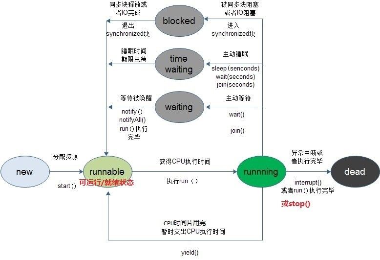
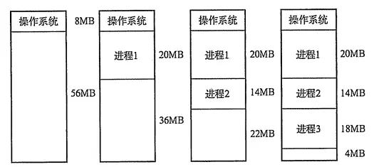
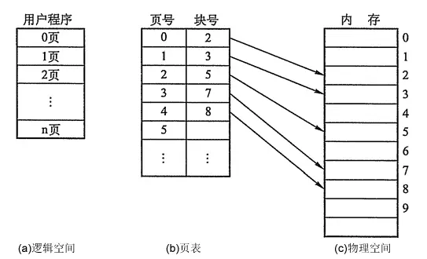
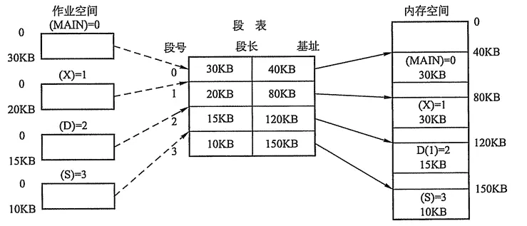

## 系统方面

### 1. 进程和线程的区别

进程：资源分配的单位，一个进程可包括多个线程，实现操作系统层面的并发。进程在执行过程中拥有独立的内存单元

**进程间通信机制**：管道/命名管道、socket、信号量、消息队列、共享内存。

线程：是进程的子任务，是cpu调度的基本单位，**实现进程内部的并发**。多个线程共享进程的内存。

**线程间通信**：互斥量Synchronized，信号量Semphare，事件（信号）wait/notify/notifyAll

**注意：**

Linux下只有一种类型的进程，那就是task_struct，当然我也想说linux其实也没有线程的概念, 只是将那些与其他进程共享资源的进程称之为线程。

一个进程由于其运行空间的不同, 从而有内核线程和用户进程的区分, 内核线程运行在内核空间, 之所以称之为线程是因为它**没有虚拟地址空间, 只能访问内核的代码和数据**, 而用户进程则运行在用户空间, 但是可以通过中断, 系统调用等方式从用户态陷入内核态。

用户进程运行在用户空间上, 而一些通过共享资源实现的一组进程我们称之为线程组, Linux下内核其实本质上没有线程的概念, Linux下线程其实上是与其他进程共享某些资源的进程而已。但是我们习惯上还是称他们为线程或者轻量级进程

因此, Linux上进程分3种，内核线程（或者叫核心进程）、用户进程、用户线程, 当然如果更严谨的，你也可以认为用户进程和用户线程都是用户进程。

### 2. 进程间的通信的几种方式

+   管道（pipe）及命名管道（named pipe）：管道可用于具有亲缘关系的父子进程间的通信，有名管道除了具有管道所具有的功能外，它还允许无亲缘关系进程间的通信；

+   信号（signal）：信号是一种比较复杂的通信方式，用于通知接收进程某个事件已经发生；

+   消息队列：消息队列是消息的链接表，它克服了上两种通信方式中信号量有限的缺点，具有写权限得进程可以按照一定得规则向消息队列中添加新信息；对消息队列有读权限得进程则可以从消息队列中读取信息；

+   共享内存：可以说这是最有用的进程间通信方式。它使得多个进程可以访问同一块内存空间，不同进程可以及时看到对方进程中对共享内存中数据得更新。这种方式需要依靠某种同步操作，如互斥锁和信号量等；

+   信号量：主要作为进程之间及同一种进程的不同线程之间得同步和互斥手段；

+   套接字：这是一种更为一般得进程间通信机制，它可用于网络中不同机器之间的进程间通信，应用非常广泛。

### 3. 说一说进程同步有哪几种机制?

（1）信号量机制
一个信号量只能置一次初值，以后只能对之进行p操作或v操作。 由此也可以看到，信号量机制必须有公共内存，不能用于分布式操作系统，这是它最大的弱点。 

（2）自旋锁
旋锁是为了保护共享资源提出的一种锁机制。 调用者申请的资源如果被占用，即自旋锁被已经被别的执行单元保持，则调用者一直循环在那里看是否该自旋锁的保持着已经释放了锁，自旋锁是一种比较低级的保护数据结构和代码片段的原始方式，可能会引起以下两个问题; 

+   死锁 
+   过多地占用CPU资源

（3）管程
信号量机制功能强大，但使用时对信号量的操作分散，而且难以控制，读写和维护都很困难。因此后来又提出了一种集中式同步进程——管程。其基本思想是将共享变量和对它们的操作集中在一个模块中，操作系统或并发程序就由这样的模块构成。这样模块之间联系清晰，便于维护和修改，易于保证正确性。 


优： 集中式同步进程——管程。其基本思想是将共享变量和对它们的操作集中在一个模块中，操作系统或并发程序就由这样的模块构成。这样模块之间联系清晰，便于维护和修改，易于保证正确性。 

缺：如果一个分布式系统具有多个CPU，并且每个CPU拥有自己的私有内存，它们通过一个局域网相连，那么这些原语将失效。而管程在少数几种编程语言之外又无法使用，并且，这些原语均未提供机器间的信息交换方法。 

（4）会合
进程直接进行相互作用 

（5）分布式系统
由于在分布式操作系统中没有公共内存，因此参数全为值参，而且不可为指针。消息和 rpc ，由于在分布式操作系统中没有公共内存，因此参数全为值参， 而且不可为指针.

### 4. 线程同步的方式

+   互斥量 Synchronized/Lock：采用互斥对象机制，只有拥有互斥对象的线程才有访问公共资源的权限。因为互斥对象只有一个，所以可以保证公共资源不会被多个zjianfa程同时访问

+   信号量 Semphare：它允许同一时刻多个线程访问同一资源，但是需要控制同一时刻访问此资源的最大线程数量

+   事件(信号)，Wait/Notify：通过通知操作的方式来保持多线程同步，还可以方便的实现多线程优先级的比较操作

### 5. 什么是死锁？死锁产生的条件？

1) 死锁的概念

在两个或者多个并发进程中，如果每个进程持有某种资源而又等待其它进程释放它或它们现在保持着的资源，在未改变这种状态之前都不能向前推进，称这一组进程产生了死锁。通俗的讲，就是两个或多个进程无限期的阻塞、相互等待的一种状态。

2) 死锁产生的四个必要条件

+   **互斥**：至少有一个资源必须属于非共享模式，即一次只能被一个进程使用；若其他申请使用该资源，那么申请进程必须等到该资源被释放为止；

+   **占有并等待**：一个进程必须占有至少一个资源，并等待另一个资源，而该资源为其他进程所占有；

+   **非抢占**：进程不能被抢占，即资源只能被进程在完成任务后自愿释放

+   **循环等待**：若干进程之间形成一种头尾相接的环形等待资源关系

3) 死锁的处理基本策略和常用方法

解决死锁的基本方法主要有 预防死锁、避免死锁、检测死锁、解除死锁 、鸵鸟策略 等。

　　(1) 死锁预防
　　
　　死锁预防的基本思想是 只要确保死锁发生的四个必要条件中至少有一个不成立，就能预防死锁的发生，具体方法包括：

​	打破互斥条件：允许进程同时访问某些资源。但是，有些资源是不能被多个进程所共享的，这是由资源本身属性所决定的，因此，这种办法通常并无实用价值。

​	打破占有并等待条件：可以实行资源预先分配策略(进程在运行前一次性向系统申请它所需要的全部资源，若所需全部资源得不到满足，则不分配任何资源，此进程暂不运行；只有当系统能满足当前进程所需的全部资源时，才一次性将所申请资源全部分配给该线程)或者只允许进程在没有占用资源时才可以申请资源（一个进程可申请一些资源并使用它们，但是在当前进程申请更多资源之前，它必须全部释放当前所占有的资源）。但是这种策略也存在一些缺点：在很多情况下，无法预知一个进程执行前所需的全部资源，因为进程是动态执行的，不可预知的；同时，会降低资源利用率，导致降低了进程的并发性。

​	打破非抢占条件：允许进程强行从占有者哪里夺取某些资源。也就是说，但一个进程占有了一部分资源，在其申请新的资源且得不到满足时，它必须释放所有占有的资源以便让其它线程使用。这种预防死锁的方式实现起来困难，会降低系统性能。

​	打破循环等待条件：实行资源有序分配策略。对所有资源排序编号，所有进程对资源的请求必须严格按资源序号递增的顺序提出，即只有占用了小号资源才能申请大号资源，这样就不回产生环路，预防死锁的发生。

　　(2) 死锁避免的基本思想
　　
　　死锁避免的基本思想是**动态地检测资源分配状态，以确保循环等待条件不成立，从而确保系统处于安全状态**。

​	所谓安全状态是指：如果系统能按某个顺序为每个进程分配资源（不超过其最大值），那么系统状态是安全的，换句话说就是，如果存在一个安全序列，那么系统处于安全状态。**资源分配图算法**和**银行家算法**是两种经典的死锁避免的算法，其可以确保系统始终处于安全状态。其中，资源分配图算法应用场景为每种资源类型只有一个实例(申请边，分配边，需求边，不形成环才允许分配)，而银行家算法应用于每种资源类型可以有多个实例的场景。

　　(3) 死锁解除

　　死锁解除的常用两种方法为**进程终止**和**资源抢占**。所谓进程终止是指简单地终止一个或多个进程以打破循环等待，包括两种方式：终止所有死锁进程和一次只终止一个进程直到取消死锁循环为止；所谓资源抢占是指从一个或多个死锁进程那里抢占一个或多个资源，此时必须考虑三个问题：

　　(I). 选择一个牺牲品
　　(II). 回滚：回滚到安全状态
　　(III). 饥饿（在代价因素中加上回滚次数，回滚的越多则越不可能继续被作为牺牲品，避免一个进程总是被回滚）

#### 5.1 银行家算法

当一个进程申请使用资源的时候，银行家算法通过先 **试探** 分配给该进程资源，然后通过安全性算法判断分配后的系统是否处于安全状态，若不安全则试探分配作废，让该进程继续等待。

### 6. 进程有哪几种状态？

进程包括三种状态：就绪态、运行态和阻塞态。

注意：创建和退出不是进程的状态。阻塞和就绪的区别：阻塞是等待除CPU以外的资源，而就绪等待的是CPU资源。

+   就绪状态：进程已获得除处理机以外的所需资源，等待分配处理机资源；
+   运行状态：占用处理机资源运行，处于此状态的进程数小于等于CPU数；
+   阻塞状态： 进程等待某种条件，在条件满足之前无法执行；

### 7. 线程有几种状态？

线程各状态之间的转换如下：

[1]:<https://blog.csdn.net/justloveyou_/article/details/54347954> Java 并发：Thread 类深度解析

### 8. 操作系统中进程调度策略有哪几种？

+   FCFS(先来先服务，队列实现，非抢占的)：先请求CPU的进程先分配到CPU

+   SJF(最短作业优先调度算法)：平均等待时间最短，但难以知道下一个CPU区间长度

+   优先级调度算法(可以是抢占的，也可以是非抢占的)：优先级越高越先分配到CPU，相同优先级先到先服务，存在的主要问题是：低优先级进程无穷等待CPU，会导致无穷阻塞或饥饿；解决方案：老化

+   时间片轮转调度算法(可抢占的)：队列中没有进程被分配超过一个时间片的CPU时间，除非它是唯一可运行的进程。如果进程的CPU区间超过了一个时间片，那么该进程就被抢占并放回就绪队列。

+   多级队列调度算法：将就绪队列分成多个独立的队列，每个队列都有自己的调度算法，队列之间采用固定优先级抢占调度。其中，一个进程根据自身属性被永久地分配到一个队列中。

+   多级反馈队列调度算法：与多级队列调度算法相比，其允许进程在队列之间移动：若进程使用过多CPU时间，那么它会被转移到更低的优先级队列；在较低优先级队列等待时间过长的进程会被转移到更高优先级队列，以防止饥饿发生。

## 存储方面

### 1. 内存映射是什么？

内存映射是**共享内存**的一种实现方式，允许两个或多个进程共享一给定的存储区，因为数据不需要来回复制，所以是最快的一种进程间通信机制。共享内存可以通过内存映射实现。

传统文件访问方法是，如果有多个进程访问一个文件，则每一个进程在自己的地址空间都包含有该文件的副本，这会浪费存储空间。当两个进程同时读一个文件的同一页时，系统要将该页从磁盘读到高速缓冲区中，每个进程再执行一个内存期内的复制操作将数据从高速缓冲区读到自己的地址空间。

共享内存映射访问文件的方法是进程A和进程B都将该页映射到自己的地址空间，当进程A第一次访问该页中的数据时，它生成一个**缺页中断**，内核此时读入这一页到内存并更新页表使之指向它，以后，当进程B访问同一页面而出现缺页中断时，该页已经在内存，内核只需要将进程B的页表登记项指向此页即可。

### 2. 内存连续分配

主要是指动态分区分配时所采用的几种算法。
动态分区分配又称为可变分区分配，是一种动态划分内存的分区方法。这种分区方法不预先将内存划分，而是在进程装入内存时，根据进程的大小动态地建立分区，并使分区的大小正好适合进程的需要。因此系统中分区的大小和数目是可变的。

**首次适应(First Fit)算法：**空闲分区以地址递增的次序链接。分配内存时顺序查找，找到大小能满足要求的第一个空闲分区。(非排序)

**最佳适应(Best Fit)算法：**空闲分区按容量递增形成分区链，找到第一个能满足要求的空闲分区。（升序）

**最坏适应(Worst Fit)算法：**又称最大适应(Largest Fit)算法，空闲分区以容量递减的次序链接。找到第一个能满足要求的空闲分区，也就是挑选出最大的分区。(降序)

### 2. 基本分页储存管理方式

把主存空间划分为大小相等且固定的块，块相对较小，作为主存的基本单位。每个进程也以块为单位进行划分，进程在执行时，以块为单位逐个申请主存中的块空间。

因为程序数据存储在不同的页面中，而页面又离散的分布在内存中，**因此需要一个页表来记录逻辑地址和实际存储地址之间的映射关系，以实现从页号到物理块号的映射。**

由于页表也是存储在内存中的，因此和不适用分页管理的存储方式相比，访问分页系统中内存数据需要**两次的内存访问**(一次是从内存中访问页表，从中找到指定的物理块号，加上页内偏移得到实际物理地址；第二次就是根据第一次得到的物理地址访问内存取出数据)。

为了减少两次访问内存导致的效率影响，分页管理中引入了**快表机制**，包含快表机制的内存管理中，当要访问内存数据的时候，首先将页号在快表中查询，如果查找到说明要访问的页表项在快表中，那么直接从快表中读取相应的物理块号；如果没有找到，那么访问内存中的页表，从页表中得到物理地址，同时将页表中的该映射表项添加到快表中(可能存在快表换出算法)。

在某些计算机中如果内存的逻辑地址很大，将会导致程序的页表项会很多，而页表在内存中是连续存放的，所以相应的就需要较大的连续内存空间。为了解决这个问题，可以采用**两级页表或者多级页表的方法**，其中外层页表一次性调入内存且连续存放，内层页表离散存放。相应的访问内存页表的时候需要一次地址变换，访问逻辑地址对应的物理地址的时候也需要一次地址变换，而且一共需要访问内存3次才可以读取一次数据。

### 3. 基本分段储存管理方式

分页是为了提高内存利用率，而分段是为了满足程序员在编写代码的时候的一些逻辑需求(比如数据共享，数据保护，动态链接等)。

分段内存管理当中，**地址是二维的，一维是段号，一维是段内地址；其中每个段的长度是不一样的，而且每个段内部都是从0开始编址的**。由于分段管理中，**每个段内部是连续内存分配，但是段和段之间是离散分配的**，因此也存在一个逻辑地址到物理地址的映射关系，相应的就是段表机制。段表中的每一个表项记录了该段在内存中的起始地址和该段的长度。段表可以放在内存中也可以放在寄存器中。

访问内存的时候根据段号和段表项的长度计算当前访问段在段表中的位置，然后访问段表，得到该段的物理地址，根据该物理地址以及段内偏移量就可以得到需要访问的内存。由于也是两次内存访问，所以分段管理中同样引入了联想寄存器。

#### 分段分页方式的比较

页是信息的物理单位，是出于系统内存利用率的角度提出的离散分配机制；段是信息的逻辑单位，每个段含有一组意义完整的信息，是出于用户角度提出的内存管理机制

页的大小是固定的，由系统决定；段的大小是不确定的，由用户决定

### 4. 虚拟内存

基于局部性原理，**在程序装入时，可以将程序的一部分装入内存，而将其余部分留在外存**，就可以启动程序执行。在程序执行过程中，**当所访问的信息不在内存时，由操作系统将所需要的部分调入内存,然后继续执行程序**。另一方面，操作系统将内存中**暂时不使用的内容换出到外存上，从而腾出空间存放将要调入内存的信息**。这样，系统好像为用户提供了一个比实际内存大得多的存储器，称为虚拟存储器。

​	虚拟内存：解决物理内存地址不够用的问题，使用虚拟逻辑地址，让需要大内存的进程可运行。

​	虚拟内存允许执行进程不必完全在内存中。虚拟内存的基本思想是：每个进程拥有独立的地址空间，这个空间被分为大小相等的多个块，称为页(Page)，每个页都是一段连续的地址。这些页被映射到物理内存，但并不是所有的页都必须在内存中才能运行程序。当程序引用到一部分在物理内存中的地址空间时，由硬件立刻进行必要的映射；当程序引用到一部分不在物理内存中的地址空间时，由操作系统负责将缺失的部分装入物理内存并重新执行失败的命令。这样，对于进程而言，逻辑上似乎有很大的内存空间，实际上其中一部分对应物理内存上的一块(称为**帧，通常页和帧大小相等**)，还有一些没加载在内存中的对应在硬盘上，如图5所示。

注意，请求分页系统、请求分段系统和请求段页式系统都是针对虚拟内存的，通过请求实现内存与外存的信息置换。

 **虚拟内存的应用与优点**

　　虚拟内存很适合在多道程序设计系统中使用，许多程序的片段同时保存在内存中。当一个程序等待它的一部分读入内存时，可以把CPU交给另一个进程使用。虚拟内存的使用可以带来以下好处：

+   在内存中可以保留多个进程，系统并发度提高

+   解除了用户与内存之间的紧密约束，进程可以比内存的全部空间还大

	计算机会对虚拟内存地址空间（32位为4G）分页产生页（page），对物理内存地址空间（假设256M）分页产生页帧（page frame），这个页和页帧的大小是一样大的，所以，虚拟内存页的个数势必要大于物理内存页帧的个数。在计算机上有一个页表（page table），就是映射虚拟内存页到物理内存页的，更确切的说是页号到页帧号的映射，而且是一对一的映射。但是问题来了，虚拟内存页的个数 > 物理内存页帧的个数，岂不是有些虚拟内存页的地址永远没有对应的物理内存地址空间？不是的，操作系统是这样处理的。操作系统有个页面失效（page fault）功能。操作系统找到一个最少使用的页帧，让他失效，并把它写入磁盘，随后把需要访问的页放到页帧中，并修改页表中的映射，这样就保证所有的页都有被调度的可能了。这就是处理虚拟内存地址到物理内存的步骤。
	
	现在来回答什么是虚拟内存地址和物理内存地址。虚拟内存地址由页号（与页表中的页号关联）和偏移量组成。页号就不必解释了，上面已经说了，页号对应的映射到一个页帧。那么，说说偏移量。偏移量就是上面说的页（或者页帧）的大小，即这个页（或者页帧）到底能存多少数据。举个例子，有一个虚拟地址它的页号是4，偏移量是20，那么他的寻址过程是这样的：首先到页表中找到页号4对应的页帧号（比如为8），如果页不在内存中，则用内存替换策略调入页，否则把页帧号和偏移量传给MMC（CPU的内存管理单元）组成一个物理上真正存在的地址，接着就是访问物理内存中的数据了。

总结起来说，虚拟内存地址的大小是与地址总线位数相关，物理内存地址的大小跟物理内存条的容量相关。

### 页面置换算法

FIFO先进先出算法：在操作系统中经常被用到，比如作业调度（主要实现简单，很容易想到）；

LRU（Least recently use）最近最少使用算法：根据使用时间到现在的长短来判断；

LFU（Least frequently use）最少使用次数算法：根据使用次数来判断；

OPT（Optimal replacement）最优置换算法：理论的最优，理论；就是要保证置换出去的是不再被使用的页，或者是在实际内存中最晚使用的算法。

### 颠簸

颠簸本质上是指频繁的页调度行为，具体来讲，进程发生缺页中断，这时，必须置换某一页。然而，其他所有的页都在使用，它置换一个页，但又立刻再次需要这个页。因此，会不断产生缺页中断，导致整个系统的效率急剧下降，这种现象称为颠簸（抖动）。

内存颠簸的解决策略包括：

+   如果是因为页面替换策略失误，可以修改替换算法来解决这个问题；

+   如果是因为运行的程序太多，造成程序无法同时将所有频繁访问的页面调入内存，则要降低多道程序的数量；

+   否则，还剩下两个办法：终止该进程或增加物理内存容量。

### 局部性原理

(1) 时间上的局部性：最近被访问的页在不久的将来还会被访问；

(2) 空间上的局部性：内存中被访问的页周围的页也很可能被访问。

### 分页和分段有什么区别（内存管理）？

​	段式存储管理是一种符合用户视角的内存分配管理方案。在段式存储管理中，将程序的地址空间划分为若干段（segment），如代码段，数据段，堆栈段；这样每个进程有一个二维地址空间，相互独立，互不干扰。段式管理的优点是：没有内碎片（因为段大小可变，改变段大小来消除内碎片）。但段换入换出时，会产生外碎片（比如4k的段换5k的段，会产生1k的外碎片）

　　页式存储管理方案是一种用户视角内存与物理内存相分离的内存分配管理方案。在页式存储管理中，将程序的逻辑地址划分为固定大小的页（page），而物理内存划分为同样大小的帧，程序加载时，可以将任意一页放入内存中任意一个帧，这些帧不必连续，从而实现了离散分离。页式存储管理的优点是：没有外碎片（因为页的大小固定），但会产生内碎片（一个页可能填充不满）。

**两者的不同点：**

目的不同：分页是由于系统管理的需要而不是用户的需要，它是信息的物理单位；分段的目的是为了能更好地满足用户的需要，它是信息的逻辑单位，它含有一组其意义相对完整的信息；

大小不同：页的大小固定且由系统决定，而段的长度却不固定，由其所完成的功能决定；

地址空间不同： 段向用户提供二维地址空间；页向用户提供的是一维地址空间；

信息共享：段是信息的逻辑单位，便于存储保护和信息的共享，页的保护和共享受到限制；

内存碎片：页式存储管理的优点是没有外碎片（因为页的大小固定），但会产生内碎片（一个页可能填充不满）；而段式管理的优点是没有内碎片（因为段大小可变，改变段大小来消除内碎片）。但段换入换出时，会产生外碎片（比如4k的段换5k的段，会产生1k的外碎片）。

### 32位系统和64位系统的区别？

1) 寄存器位数不同：32位系统的 cpu 寄存器为32位，一次可处理运算32bit(4B)数据，64位处理器每次处理 8Byte(64bit)。

2) 数据总线个数不同：32位系统的数据总线为32根，一次可读取的数据宽度为32位, 64位CPU的数据总线为64根，也就是说处理器一次可读取64位数据。

3) 地址总线个数不同：32位系统的地址总线为32根，可支持2^32（4G）虚拟内存地址，但物理内存地址由内存条大小决定，物理内存中放不下的用磁盘空间来顶替。64位系统的地址总线一般采用的是36位或者40位（即CPU能够寻址的物理地址空间为64GB或者1T）。