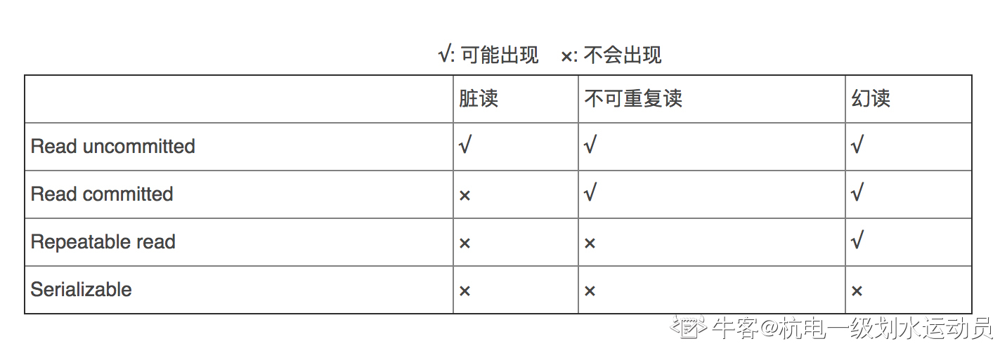
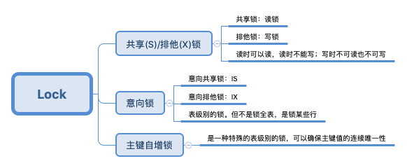
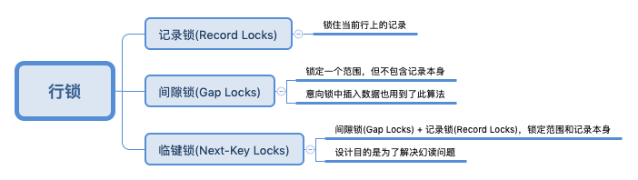
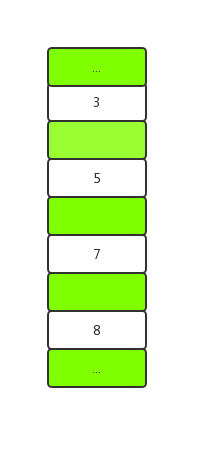
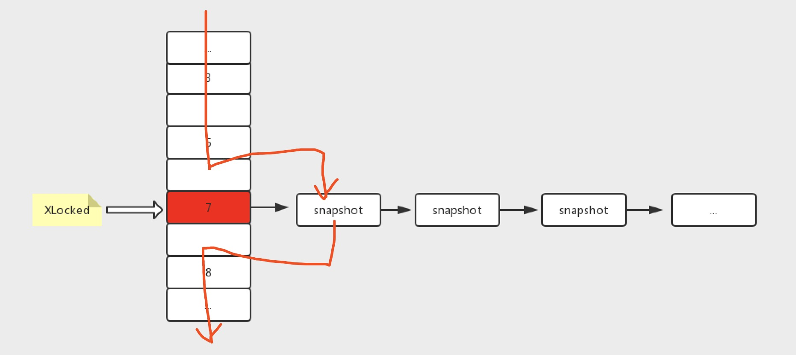

# 数据库汇总

>   date: 20200401 周建发

## 1. 数据库概念

### 1 数据库范式

+   第一范式：列不可分，eg:【联系人】（姓名，性别，电话），一个联系人有家庭电话和公司电话，那么这种表结构设计就没有达到 1NF；
+   第二范式：非主属性完全函数依赖于候选键。。eg:订单明细表【OrderDetail】（OrderID，ProductID，UnitPrice，Discount，Quantity，ProductName），Discount（折扣），Quantity（数量）完全依赖（取决）于主键（OderID，ProductID），而 UnitPrice，ProductName 只依赖于 ProductID，不符合2NF；
+   第三范式：无传递依赖(非主键列 A 依赖于非主键列 B，非主键列 B 依赖于主键的情况)， 每一列数据都和主键直接相关，而不能间接相关. eg:订单表【Order】（OrderID，OrderDate，CustomerID，CustomerName，CustomerAddr，CustomerCity）主键是（OrderID），CustomerName，CustomerAddr，CustomerCity 直接依赖的是 CustomerID（非主键列），而不是直接依赖于主键，它是通过传递才依赖于主键，所以不符合 3NF。

**这里需要指明范式不是最好的，我们需要混合使用范式和反范式**：

+   范式的优点：因为相对来说有较少的重复数据，范式化的更新操作要比反范式快。同时范式化需要更少的distinct和order by
+   范式化缺点：通常需要关联，不仅代价昂贵，也可能会使的一些索引无效
+   常用的反范式方法：
    1.  复制：在两个表中根据实际业务情况存储**部分**相同的字段列，即有利于查询，也不会把表搞的太大

    2.  缓存：对于需要多次join查询的表，可以在一个表中加入一个缓存列，用来缓存所join表的部分常用数据，如count等，我们需要实时更新该缓存

        

### 2 说一下内连接和外连接

+   内连接也叫自然连接，只有两个表相匹配的行才能在结果集中出现。返回的结果集选取两个表中所匹配的数据，舍弃不匹配的数据

    

+   内连接保证两个表中的所有行都满足条件，而外连接则不然，外连接不仅仅包含符合连接条件的行，而且还包括左表（左外连接），右表（右外连接），或者两个边表（全外连接）中的所有数据行

    +   左连接：左边有的，右边没有的为null
    +   右连接：左边没有的，右边有的为null

    *目前（8.0）MySQL不支持全外连接*


### 3 存储过程

存储过程是由一组 SQL 语句构成，预先编译好后存储在数据库中，可供前台应用程序多次调用。使用存储过程既能方便软件开发，又能减少解释执行 SQL 语句时句法分析和查询优化的时间，提高了效率。

优点：

+   可以重复使用
+   提高性能，使用时无需编译
+   减少网络流量
+   增加安全性，方式注入式 SQL 攻击，用户只有执行权限
+   可将 Grant、 Deny和 Revoke应用于存储过程

**存储过程的优化思路：**

+   尽量利用一些 SQL 语句来替代一些小循环，例如聚合函数，求平均函数等
+   中间结果存放于临时表，加索引
+   少使用游标。SQL 是个集合语言，对于集合运算具有较高性能。而 cursors 是过程运算。比如
    对一个 100 万行的数据进行查询。游标需要读表 100 万次，而不使用游标则只需要少量几次
    读取
+   事务越短越好。SQL Server支持并发操作。如果事务过多过长，或者隔离级别过高，都会造成
    并发操作的阻塞，死锁。导致查询极慢，cpu占用率极地
+   使用 try-catch 处理错误异常
+   查找语句尽量不要放在循环内

### 4 触发器

触发器，是一类由数据库操作事件(插入、删除、修改)驱动的特殊过程，一旦由某个用户定义，任何用户对该触发器指定的数据进行增删改操作时，系统将自动激活响应的触发动作，在数据库服务器上进行集中的完整性控制。触发器的定义包括两部分内容：

+   指明触发器的触发事件
+   指明触发器执行的动作
    触发器的类型：

| 触发方式   | For each statement                           | For each row                                               |
| ---------- | -------------------------------------------- | ---------------------------------------------------------- |
| before选项 | 语句前触发器，在执行触发语句前激活触发器一次 | 行前触发器，在执行触发语句所影响的每一行前，激活触发器一次 |
| after选项  | 语句前触发器，在执行触发语句后激活触发器一次 | 行前触发器，在执行触发语句所影响的每一行后，激活触发器一次 |

优点：

+   安全性：可以基于数据库的值使用户具有操作数据库的某种权利。可以基于时间限制用户的操作，例如不允许下班后和节假日修改数据库数据；可以基于数据库中的数据限制用户的操作，例如不允许股票的价格的升幅一次超过10%
+   审计：可以跟踪用户对数据库的操作。审计用户操作数据库的语句；把用户对数据库的更新写入审计表。
+   实现复杂的数据完整性规则：实现非标准的数据完整性检查和约束。触发器可产生比规则更为复杂的限制。与规则不同，触发器可以引用列或数据库对象。例如，触发器可回退任何企图吃进超过自己保证金的期货。提供可变的缺省值。
+   同步实时地复制表中的数据。

缺点：

+   消耗资源

+   延长响应时间

    

## 2. 事务

事务是 RDBMS (关系数据库管理系统)提供的一种特殊手段。通过这一手段，应用程序将一系列的数据库操作组合在一起，作为一个整体执行，以保证数据库处于一致性状态。一个事务，可以是一个 SQL 语句，一组 SQL 语句或整个程序。事务的开始可以由用户显示控制。如果用户没有显示定义，则由具体的 DBMS 按缺省规定自动划分事务。事务可以嵌套使用，一个嵌套事务可以包含若干个子事务。在嵌套事务中，必须先完成所有的子事务，才能提交顶级事务。事务具有四个特性：

### 1 ACID 讲一下

ACID是事物的四个特性。分别是 原子性(Atomicity)、一致性(Consistency)、隔离性(Isolation)、持久性(Durability) 。

+   原子性是指**事务是一个不可分割的工作单位，事物中的操作要么都发生，要么都不发生**。最经典的就是转账案例，我们把转入和转出当做一个事物的话，就需要在SQL中显式指定开启事务。
+   一致性是说**数据库事务不能破坏关系数据的完整性以及业务逻辑上的一致性** 。我们可以从数据库层面和业务层面两方面来保证，数据库层面我们可以设置触发器，外键，表，行约束等来保证，业务层面就是我们Java工程师的工作啦
+   隔离性指的是**多个事务并发访问时，事务之间是隔离的，一个事务不应该影响其它事务运行效果**。 多个事务并发访问时，事务之间是隔离的，一个事务不应该影响其它事务运行效果。 *这个点又引申出了下面两道题，以及后边的加锁和阻塞*
+   持久性意味着即使出现了任何事故比如断电等，事务一旦提交，则持久化保存在数据库中，不会被回滚。


### 2. 并发操作可能产生的异常

如果数据库不采用并发操作，那么会使用户的响应时间变得极大，且无法充分利用集群的资源。采用并发操作，可以：

+   提高系统资源利用率
+   改善事务的响应时间
    虽然产生并发操作可以带来诸多优点，但是会产生一些并发性问题：
+   丢失更新：当访问同一数据的多个事务以某种方式交替执行时(对同一数据写)，就可能产生丢失更新问题
+   读脏：事务更新了某个数据，接着由于某个原因事务被撤销，然而所更新的数据在被恢复之前，另一个事务读取了该数据
+   不可重复读：事务 A 需要对同一数据读取两次，然而两次读取间隔中，事务 B 修改了该数据导致事务 A 前后读取了不一致的值
+   幻读：事务 A 重复执行两次期间其他事务执行了插入、删除操作，使得事务 A 第二次查询的结果集与第一次查询不同


### 3. 说一下脏读，不可重复读和幻读

+   脏读： 意味着一个事务读取了另一个事务**未提交**的数据，而这个数据是有可能回滚的。即这个事物读取的数据是不正确的
+   不可重复读： 在数据库访问中，**一个事务范围**内**两个相同的查询**却返回了**不同**数据。这是由于查询时系统中其他事务修改的提交而引起的。即这个事物在读的过程中被修改了
+   幻读：当一个事务对**整个table进行修改**之后，第二个事务向表中**插入**了一行数据，此时第一个事物发现了新插入的没有修改的数据行，好像发生了幻觉一样


### 4. 数据库的隔离级别

+   读未提交RU
    1.  一个事务还没提交时，它做的变更就能被**别的事务看到**
    2.  会出现幻读，不可重复读，脏读
    3.  更新数据时加上**行级共享锁**，事物结束即释放
+   读已提交RC （大部分数据库的隔离级别）
    1.  一个事务提交之后，它做的变更才会被其他事务看到
    2.  会出现幻读，不可重复读，不会出现脏读
    3.  写数据加**行级排他锁**，这样写过程是无法读取的，直到事务处理完毕才释放排他锁，给读的数据加**行级共享锁**，这样读的时候也是无法写的，但是**一旦读完该行就释放共享锁**
    4.  MySQL会在SQL语句开始执行时创建一个视图
+   可重复读RR（Mysql 默认级别）
    1.  一个事务执行过程中看到的数据，总是跟这个事务在启动时看到的数据是一致的
    2.  会出现幻读，不会出现不可重复读，脏读
    3.  给写的数据加**行级排他锁**，事务结束释放，给读的数据加行级共享锁，**事务结束后释放**
    4.  MySQL会在事物开始时创建一个一致性视图*(接下面的MVCC)*，事物结束时销毁。InnoDB和Falcon存储引擎通过多版本并发控制（MVCC，Multiversion Concurrency Control）机制解决了该问题。
+   可串行化S
    1.  当出现读写锁冲突的时候，后访问的事务必须等前一个事务执行完成，才能继续执行
    2.  不会出现幻读，不可重复读，脏读
    3.  事务读数据则加**表级共享锁**，事务写数据则加**表级排他锁**
    4.  不区分快照度与当前读

其中，Oracle和SQLServer都是**读已提交**，但MySQL默认的隔离级别是**可重复读** ，这是一个MySQL5.0之前的上古遗留版本问题。当时的binlog只有STATEMENT格式，用RC会出现bug。



MySQL中修改事务隔离级别的方法：

```bash
`在MySQL配置文件中[mysqld]添加一行：transaction-isolation=READ-COMMITTED`
```

### 5. 不可重复读和幻读的区别

不可重复读重点在于 update 和 delete ，而幻读的重点在于 insert。如果使用锁机制来实现这两种隔离级别，在可重复读中，该 sql 第一次读取到数据后，就将这些数据加锁，其它事务无法修改这些数据，就可以实现可重复读了。但这种方法却无法锁住 insert 的数据，所以当事务 A 先前读取了数据，或者修改了全部数据，事务 B 还是可以insert数据提交，这时事务 A 就会发现莫名其妙多了一条之前没有的数据，这就是幻读，不能通过行锁来避免。需要 Serializable 隔离级别，读用读锁，写用写锁，读锁和写锁互斥，这么做可以有效的避免幻读、不可重复读、脏读等问题，但会极大的降低数据库的并发能力。所以说不可重复读和幻读最大的区别，就在于如何通过锁机制来解决他们产生的问题。

### 6. Record、Gap Next-Key Lock

+   innodb对于行的查询使用 Next-key lock
+   Next-key lock为了解决Phantom Problem幻读问题
+   当查询的索引含有唯一属性时，将 Next-key lock 降级为 record key
+   Gap 锁设计的目的是为了阻止多个事务将记录插入到同一范围内，而这会导致幻读问题的产生
+   有两种方式显式关闭 gap 锁：（除了外键约束和唯一性检查外，其余情况仅使用record lock） A. 将事务隔离级别设置为Read Commited B. 将参数innodb_locks_unsafe_for_binlog设置为1

### 7. 数据库的封锁

封锁是普遍采用的一种并发控制手段，封锁可以避免并发操作出现的问题。所谓封锁就是某事务在执行操作前，先对此对象加上自己的锁。加锁后其他事务对此对象的操作就受到了规定的限制。事务结束后再释放锁。锁的基本类型有两种：

+   排它锁
+   共享锁
    数据库中使用三级封锁协议来执行并发控制：
+   一级封锁协议：事务 A 在修改某一数据项前，必须先对其加上自己的排他锁，直到事务结束前才能释放之。事务结束包括正常结束和非正常结束(回滚)。该协议可解决丢失更新，不保证读脏、可重复读
+   二级封锁协议：一级封锁协议；任一事务在读取某数据前(不修改)，必须先对其加共享锁，读完即可释放共享锁。该协议可防止更新丢失和读脏，不保证可重复读
+   三级封锁协议：一级封锁协议；任一事务在读取某数据前(不修改)，必须先对其加共享锁，事务结束才释放共享锁。该协议可防止更新丢失、读脏、不可重复读等一致性问题

### 8. 数据库事务的传播行为

+   PROPAGATION_REQUIRED：如果当前没有事务，就创建一个新事务，如果当前存在事务，就加入该事务，该设置是最常用的设置。
+   PROPAGATION_NESTED：如果当前存在事务，则在嵌套事务内执行。如果当前没有事务，则执行与PROPAGATION_REQUIRED类似的操作
+   PROPAGATION_SUPPORTS：支持当前事务，如果当前存在事务，就加入该事务，如果当前不存在事务，就以非事务执行。
+   PROPAGATION_MANDATORY：支持当前事务，如果当前存在事务，就加入该事务，如果当前不存在事务，就抛出异常。
+   PROPAGATION_REQUIRES_NEW：支持当前事务，创建新事务，无论当前存不存在事务，都创建新事务。
+   PROPAGATION_NOT_SUPPORTED：以非事务方式执行操作，如果当前存在事务，就把当前事务挂起。
+   PROPAGATION_NEVER：以非事务方式执行，如果当前存在事务，则抛出异常。


## 3. MySQL索引

索引是一种数据结构，用于帮助我们在**大量数据**中快速定位到我们想要查找的数据。可以加快查的速度，但是会增加容量，降低增，删，改的速度。

### 1. MySQL有哪几种索引类型，各自特点（索引的分类）

常见的MySQL索引结构有B-树索引，B+树索引，Hash索引和全文索引

+   B-Tree索引
    +   因为存储引擎不用进行全表扫描来获取数据，直接从索引的根节点开始搜索，从而能加快访问数据的速度
    +   B-Tree对索引是顺序组织存储的，很适合**查找范围数据**
    +   适用于全键值、键值范围或者键前缀查找*（根据最左前缀查找）*
    +   限制：对于联合索引来说，如果不是从最左列开始查找，则无法使用索引；不能跳过索引中的列
+   B+Tree索引
    +   是B-Tree索引的变种，现在主流的存储引擎都不用单纯的B-Tree，而是其变种B+Tree或者T-Tree等等
    +   和B-Tree最主要的区别就是**B+Tree的内节点不存储data，只存储key，叶子节点不存储指针**
    +   B+ 树索引的本质就是 B+ 树在数据库中的实现。但是 B+ 索引在数据库中有一个特点是高扇出性，因此在数据库中，B+数的高度一般为2-4层，意味着查找某一键值的行记录时最多需要2-4次I/O。数据库中的B+树索引分为聚簇索引和非聚簇索引。二者内部结构均为B+树，即高度平衡的，叶子节点存放数据。而二者不同的是，聚簇索引的叶子节点存放一整行的信息。不同存储引擎以不同的方式使用B-Tree索引，性能也各有不同。MyIASM索引通过数据的物理位置引用被索引的行，而InnoDB则根据主键引用被索引的行。B-Tree索引适用于全键值、键值范围或键前缀查找。其中键前缀查找只适用于根据最左前缀的查找。
+   Hash索引
    +   哈希索引中只包含哈希值和行指针，而不存储字段值，所以不能使用索引中的值来避免读取行。
    +   基于Hash表实现，只有Memory存储引擎显式支持哈希索引
    +   适合**等值查询**，如`=`、`in()`、`<=>`，不支持范围查询
    +   因为不是按照索引值顺序存储的，就不能像B+Tree索引一样利用索引完成排序
    +   Hash索引在查询等值时非常快
    +   因为Hash索引始终索引的**所有列的全部内容**，所以不支持部分索引列的匹配查找
    +   如果有大量重复键值得情况下，哈希索引的效率会很低，因为存在哈希碰撞问题
    +   程序员可以在B+Tree索引的基础上创建自适应Hash索引
+   全文索引
    +   全文索引是一种特殊类型的索引，它查找的是文本中的关键词，而不是直接比较索引中的值。全文索引和其他几类索引的匹配方式不同。需要注意很多细节，例如停用词、词干和复数、布尔搜索等。全文索引更类似于搜索引擎做的事情，而不是简单的 where 条件匹配。
    +   MyISAM和InnoDB都支持全文索引
    +   有三种模式：自然语言模式，布尔模式和查询扩展模式
+   R-Tree索引
    +   MyISAM支持R-Tree索引，这个和全文索引基本不问

#### 为什么不用B树

用 B+ 树而不用 B 树考虑的是 IO 对性能的影响，B 树的每个节点都存储数据，而 B+ 树只有叶子节点才存储数据，所以查找相同数据量的情况下，B 树的高度更高，IO 更频繁。数据库索引是存储在磁盘上的，当数据量大时，就不能把整个索引全部加载到内存了，只能逐一加载每一个磁盘页（对应索引树的节点）。此外 B+ 树更擅长范围查询。叶子节点数据是按顺序放置的双向链表。B 树范围查询只能中序遍历。

#### B树和B+树在用于文件系统时的区别

+   B树的关键字集合分布在整颗树中
+   B树任何一个关键字出现且只出现在一个结点中
+   B树搜索有可能在非叶子结点结束
+   B+树的中间节点不保存数据，所以磁盘页能容纳更多节点元素，更“矮胖”
+   B+树查询必须查找到叶子节点，b树只要匹配到即可不用管元素位置，因此b+树查找更稳定（并不慢）
+   对于范围查找来说，b+树只需遍历叶子节点链表即可，b树却需要重复地中序遍历

#### 一棵B+树能存多少行数据

以页大小为 16k 为例，若单行数据占 1k ，则每个叶子节点能存 16 行数据。中间节点假设主键大小为 8k， 指针节点为 6k， 则每个中间节点能存 16384/14=1170 个索引。双层可存 1170 * 16=18720 条数据；三层可存 1170 * 1170 * 16=21902400 条数据。


### 2 索引的底层实现原理和优化

　　在数据结构中，我们最为常见的搜索结构就是二叉搜索树和AVL树(高度平衡的二叉搜索树，为了提高二叉搜索树的效率，减少树的平均搜索长度)了。然而，无论二叉搜索树还是AVL树，当数据量比较大时，都会由于树的深度过大而造成I/O读写过于频繁，进而导致查询效率低下，因此对于索引而言，多叉树结构成为不二选择。特别地，B-Tree的各种操作能使B树保持较低的高度，从而保证高效的查找效率。

### 3 索引的优点

+   通过创建唯一性索引，可以保证数据库表中每一行数据的唯一性
+   可以大大加快数据的检索速度，这也是创建索引的最主要的原因
+   可以加速表和表之间的连接，特别是在实现数据的参考完整性方面特别有意义
+   在使用分组和排序子句进行数据检索时，同样可以显著减少查询中分组和排序的时间
+   通过使用索引，可以在查询的过程中，使用优化隐藏器，提高系统的性能
+   索引可以将随机 I/O 变成顺序 I/O
+   索引可以帮助服务器避免排序和临时表

### 4. 索引的缺点

+   创建索引和维护索引要耗费时间，这种时间随着数据量的增加而增加
+   索引需要占物理空间，除了数据表占数据空间之外，每一个索引还要占一定的物理空间，如果要建立聚簇索引，那么需要的空间就会更大
+   当对表中的数据进行增加、删除和修改的时候，索引也要动态的维护，这样就降低了数据的维护速度

### 5.  什么情况下设置了索引但无法使用？

+   以“%(表示任意0个或多个字符)”开头的LIKE语句，模糊匹配；
+   OR语句前后没有同时使用索引；
+   数据类型出现隐式转化（如varchar不加单引号的话可能会自动转换为int型）
+   对于多列索引，必须满足 最左匹配原则 (eg：多列索引col1、col2和col3，则 索引生效的情形包括 col1或col1，col2或col1，col2，col3)。

### 6. 怎么查看MySQL语句有没有用到索引

通过explain，如

```SQL
`EXPLAIN SELECT * FROM employees.titles WHERE emp_no=``'10001'` `AND title=``'Senior Engineer'` `AND from_date=``'1986-06-26'``;`
```

| id   | select_type | table  | partitions | type  | possible_keys | key     | key_len | ref               | filtered | rows | Extra |
| ---- | ----------- | ------ | ---------- | ----- | ------------- | ------- | ------- | ----------------- | -------- | ---- | ----- |
| 1    | SIMPLE      | titles | null       | const | PRIMARY       | PRIMARY | 59      | const,const,const | 10       | 1    |       |

面试官很有可能问一些字段的意思：

id：在⼀个⼤的查询语句中每个**SELECT**关键字都对应⼀个唯⼀的id ，如`explain select * from s1 where id = (select id from s1 where name = 'egon1');` 第一个select的id是1，第二个select的id是2。有时候会出现两个select，但是id却都是1，这是因为优化器把子查询变成了连接查询

select_type：select关键字对应的那个查询的类型，如`SIMPLE`,`PRIMARY`,`SUBQUERY`,`DEPENDENT`,`SNION`

table：每个查询对应的表名

type：执行查询的访问方法，如`const`*(主键索引或者唯一二级索引进行等值匹配的情况下)*,`ref`*(普通的⼆级索引列与常量进⾏等值匹配)*,`index`*(扫描全表索引的覆盖索引)*

possible_key：查询中可能用到的索引*(可以把用不到的删掉，降低优化器的优化时间)*

key：查询中用到的索引

filtered：查询器预测满足下一次查询条件的百分比

extra：表示额外信息，如`Using where`,`Start temporary`,`End temporary`,`Using temporary`等

### 7. 什么样的字段适合创建索引？

+   经常作查询选择的字段
+   经常作表连接的字段
+   经常出现在order by, group by, distinct 后面的字段

### 8. 创建索引时需要注意什么？

+   非空字段：应该指定列为NOT NULL，除非你想存储NULL。在mysql中，含有空值的列很难进行查询优化，因为它们使得索引、索引的统计信息以及比较运算更加复杂。你应该用0、一个特殊的值或者一个空串代替空值；
+   取值离散大的字段：（变量各个取值之间的差异程度）的列放到联合索引的前面，可以通过count()函数查看字段的差异值，返回值越大说明字段的唯一值越多字段的离散程度高；
+   索引字段越小越好：数据库的数据存储以页为单位一页存储的数据越多一次IO操作获取的数据越大效率越高。
+   写多读少尽量不要建立索引
+   可以使用倒叙索引或者hash索引
+   InnoDB的主键尽量用MySQL的自增主键

### 9 索引的分类

+   普通索引和唯一性索引：索引列的值的唯一性

    普通索引（由关键字KEY或INDEX定义的索引）的唯一任务是加快对数据的访问速度。因此，应该只为那些最经常出现在查询条件（WHEREcolumn=）或排序条件（ORDERBYcolumn）中的数据列创建索引。只要有可能，就应该选择一个数据最整齐、最紧凑的数据列（如一个整数类型的数据列）来创建索引。

    如果能确定某个数据列将只包含彼此各不相同的值，在为这个数据列创建索引的时候就应该用关键字UNIQUE把它定义为一个唯一索引。这么做的好处：一是简化了MySQL对这个索引的管理工作，这个索引也因此而变得更有效率；二是MySQL会在有新记录插入数据表时，自动检查新记录的这个字段的值是否已经在某个记录的这个字段里出现过了；如果是，MySQL将拒绝插入那条新记录。也就是说，唯一索引可以保证数据记录的唯一性。事实上，在许多场合，人们创建唯一索引的目的往往不是为了提高访问速度，而只是为了避免数据出现重复。

    主索引与唯一索引的唯一区别是：前者在定义时使用的关键字是PRIMARY而不是UNIQUE。

+   单个索引和复合索引：索引列所包含的列数

+   聚簇索引与非聚簇索引：聚簇索引按照数据的物理存储进行划分的。对于一堆记录来说，使用聚集索引就是对这堆记录进行堆划分，即主要描述的是物理上的存储。正是因为这种划分方法，导致聚簇索引必须是唯一的。聚集索引可以帮助把很大的范围，迅速减小范围。但是查找该记录，就要从这个小范围中Scan了；而非聚集索引是把一个很大的范围，转换成一个小的地图，然后你需要在这个小地图中找你要寻找的信息的位置，最后通过这个位置，再去找你所需要的记录。

### 10 主键、自增主键、主键索引与唯一索引概念区别

+   主键：指字段 唯一、不为空值 的列；

+   主键索引：指的就是主键，主键是索引的一种，是唯一索引的特殊类型。创建主键的时候，数据库默认会为主键创建一个唯一索引；

+   自增主键：字段类型为**数字**、自增、并且是主键；

+   唯一索引：索引列的值必须唯一，**但允许有空值**。主键是唯一索引，这样说没错；但反过来说，唯一索引也是主键就错误了，因为唯一索引允许空值，主键不允许有空值，所以不能说唯一索引也是主键。

### 11 主键就是聚集索引吗？主键和索引有什么区别？

主键是一种特殊的唯一性索引，其可以是聚集索引，也可以是非聚集索引。

在SQLServer中，主键的创建必须依赖于索引，默认创建的是聚集索引，但也可以显式指定为非聚集索引。

InnoDB作为MySQL存储引擎时，默认按照主键进行聚集，如果没有定义主键，InnoDB会试着使用唯一的非空索引来代替。如果没有这种索引，InnoDB就会定义隐藏的主键然后在上面进行聚集。所以，对于聚集索引来说，你创建主键的时候，自动就创建了主键的聚集索引。

### 12 聚簇索引与非聚簇索引

**聚簇索引**

InnoDB 存储引擎是索引组织表，即表中数据按照主键顺序存放。如果没有定义主键，InnoDB 会选择一个唯一的非空索引代替。如果没有这样的索引，InnoDB 会隐式定义一个主键作为聚簇索引。通常来讲，聚簇索引就是按照每张表的主键构造一棵 B+ 树，同时叶子节点中存放的即为整张表的行记录数据，也将聚簇索引的叶子结点称为数据页。同 B+ 树一样，每个数据页通过一个双向链表连接。由于实际的数据页只能按照一棵 B+ 树进行排序，因此每张表只能拥有一个聚簇索引。
聚簇索引的优点：

+   相关数据关联，这样从磁盘读取少量数据页就能获得完整的目标数据，否则将会导致大量I/O
+   聚簇索引查找速度优于非聚簇索引
+   使用覆盖索引扫描的查询可以直接使用页节点中的主键

聚簇索引的缺点：

+   聚簇索引在密集型I/O中性能优势明显，但是如果数据都在内存中，优势全无
+   插入速度严重依赖插入顺序。如果不是按照主键顺序加载数据，最好先使用OPTIMIZE TABLE命令重新组织表
+   更新聚簇索引列的代价很高
+   基于聚簇索引的表在插入新行或主键被更新导致需要移动行的时候，可能面临页分裂的情况。页分裂会导致表占用更多的磁盘空间
+   聚簇索引可能会导致全表扫描变慢，尤其是行比较稀疏，或者由于页分裂导致数据存储不连续的时候
+   二级索引(非聚簇索引)可能极大

**非聚集索引(辅助索引)**

辅助索引也称非聚簇索引，叶子节点并不包含行记录的全部数据。叶子节点除了键值以外，每个叶子节点中的索引行中还包括了一个书签。该书签用来告诉 InnoDB 存储引擎可以找到与索引的书签就是相应行的聚集索引键。非聚集索引和聚集索引一样，同样是采用平衡树作为索引的数据结构。如果给表中多个字段加上索引，那么就会出现多个独立的索引结构，每个索引（非聚集索引）互相之间不存在关联。每次给字段建一个新索引，字段中的数据就会被复制一份出来，用于生成索引。因此，给表添加索引，会增加表的体积，占用磁盘存储空间。

**聚簇索引和非聚簇索引间的区别:**

非聚集索引和聚集索引的区别在于，通过聚集索引可以查到需要查找的数据，而通过非聚集索引可以查到记录对应的主键值，再使用主键的值通过聚集索引查找到需要的数据。

+   聚簇索引和非聚簇索引是建立在B+树的基础上
+   聚簇索引：key为主键，value为其余列的数据。一个表只能有一个聚簇索引
+   非聚簇索引：除了聚簇索引外的都叫非聚簇索引
    1.  对于MyISAM的主键索引来说，它的非聚簇索引是key为主键，value为行号*(不一定)*
    2.  对于MyISAM的二级索引来说，它的非聚簇索引是key为其他列，value为行号*(不一定)*
    3.  对于InnoDB的二级索引来说，它的非聚簇索引是key为其他列，value是主键
+   非聚簇索引也叫二级索引
+   非聚集索引与聚集索引的区别在于非聚集索引的叶子节点不存储表中的数据，而是存储该列对应的主键（行号）
+   对于InnoDB来说，想要查找数据我们还需要根据主键再去聚集索引中进行查找，这个再根据聚集索引查找数据的过程，我们称为**回表**。第一次索引一般是顺序IO，回表的操作属于随机IO。需要回表的次数越多，即随机IO次数越多，我们就越倾向于使用全表扫描
+   通常情况下， 主键索引查询只会查一次，而非主键索引（非聚簇索引）需要回表查询多次。当然，如果是覆盖索引的话，查一次即可
+   注意：MyISAM无论主键索引还是二级索引都是非聚簇索引，而InnoDB的主键索引是聚簇索引，二级索引是非聚簇索引。我们自己建的索引基本都是非聚簇索引

### 2.23 覆盖索引

如果一个索引包含（覆盖）所有需要查询字段的值，我们就称之为"覆盖索引"。如`select id from tab where id = 1`，并且id是`tab`的索引，这就是一个覆盖索引。

当非聚簇索引是覆盖索引的时候，就只用查询一次即可

不管以任何方式查询表，最终都会利用主键通过聚集索引来定位到数据，聚集索引（主键）是通往真实数据所在的唯一路径。然而，有一种例外可以不使用聚集索引就能查询出所需要的数据，这种非主流的方法称之为「覆盖索引」查询，也就是平时所说的复合索引或者多字段索引查询。覆盖索引，即从非聚簇索引(辅助索引)中就可以得到查询的记录，而不需要查询聚簇索引的的记录。使用聚簇索引的好处是：

+   索引条目通常远小于数据行大小，所以如果只需要读取索引，那 MySQL 就会极大地减少数据访问量
+   因为索引是按照列值顺序存储，对于 I/O 密集型的范围查询会比随机从磁盘读取每一行数据的 I/O 要少的多
+   覆盖索引在一定程度上可以避免主键索引的二次查询.

### 2.24 组合索引(联合索引)

联合索引是指对表上的多个列进行索引。联合索引的创建方法与单个索引创建的方法一样，不同之处仅在于有多个索引列。本质上来看，联合索引也是一棵 B+ 树，不同的是，联合索引的键值数量不是 1 而是大于等于 2 。联合索引的一个好处是已经对键值进行排序，可以避免多一次的排序操作。在设计实现联合索引时，应该着重考虑索引的顺序，一般来说，将选择性最高的列放在前面较好。

因为每个select只能选择一个索引，当where条件过多时，我们可以考虑建立联合索引，即把多个列作为索引：

```sql
`create index inx_col1_col2 on tab (col1,col2);`
```

问这个问题主要是引出下面的最左前缀原则

### 2.25 MySQL的最左前缀原则

MySQL建立多列索引（联合索引）时有最左前缀的原则，即最左优先，如：

+   如果有一个2列的索引(col1,col2),则已经对(col1)、(col1,col2)上建立了索引；
+   如果有一个3列索引(col1,col2,col3)，则已经对(col1)、(col1,col2)、(col1,col2,col3)上建立了索引；

B+ 树的数据项是复合的数据结构，比如(name,age,sex)的时候，B+ 树是按照从左到右的顺序来建立搜索树的，比如当(张三,20,F)这样的数据来检索的时候，B+ 树会优先比较name来确定下一步的所搜方向，如果 name 相同再依次比较 age 和sex ，最后得到检索的数据；但当 (20,F) 这样的没有 name 的数据来的时候， B+ 树就不知道第一步该查哪个节点，因为建立搜索树的时候 name 就是第一个比较因子，必须要先根据 name 来搜索才能知道下一步去哪里查询。比如当 (张三,F) 这样的数据来检索时， b+ 树可以用 name 来指定搜索方向，但下一个字段 age 的缺失，所以只能把名字等于张三的数据都找到，然后再匹配性别是F的数据了， 这个是非常重要的性质，即索引的最左匹配特性。（这种情况无法用到联合索引）

最左前缀的使用说明：

+   mysql会一直向右匹配直到遇到范围查询(>、<、between、like)就停止匹配，比如a = 1 and b = 2 and c > 3 and d = 4 如果建立(a,b,c,d)顺序的索引，d是用不到索引的，如果建立(a,b,d,c)的索引则都可以用到，a,b,d的顺序可以任意调整
+   和in可以乱序，比如a = 1 and b = 2 and c = 3 建立(a,b,c)索引可以任意顺序，mysql的查询优化器会帮你优化成索引可以识别的形式

在mysql建立联合索引时会遵循最左前缀匹配的原则，即最左优先，在检索数据时从联合索引的最左边开始匹配.

对列col1、列col2和列col3建一个联合索引

```sql
KEY test_col1_col2_col3 on test(col1,col2,col3);
```

联合索引 test_col1_col2_col3 实际建立了(col1)、(col1,col2)、(col,col2,col3)三个索引。

```sql
SELECT * FROM test WHERE col1=“1” AND clo2=“2” AND clo4=“4”
```

上面这个查询语句执行时会依照最左前缀匹配原则，检索时会使用索引(col1,col2)进行数据匹配。

这里主要是向面试官说明组合索引在B+树上如何被创建的，对于索引`(a,b,c)`，引擎会先按照a排序，当a相等时，再按照b排序，当b相等时，再按照c排序。

对于索引`(a,b,c)`来说，能命中的where语句有

1.  `where a = 1`,`where a = 1 and b = 1`和`where a = 1 and b = 1 and c = 1`
2.  `where a like '1%'`，对于这个，可能会引出前缀索引

**注意**：

对于表tab`id,name,gender`来说：

+   当SQL为`select name, id from tab where name = 'stalern'`，索引为`id, name`，此时索引是有效的，走得是覆盖索引，但是命中率特别低
+   当SQL为`select * from tab where id > 0 and id < 10 and name > 'stalern'`，索引为`id,name`，此时并不会用到`id,name`，而是其中的`id`索引，没有`name`。但是当SQL为`select * from tab where id = 0 and name > 'a' and name < 'c'`时，这个索引是可以全部用到的

### 最左索引前缀失效的情况

下面对索引失效的情况简要列出：

+   如果条件中有or，即使其中有条件带索引也不会使用
+   对于多列索引，不是使用的第一部分，则不会使用索引
+   like 查询是以%开头
+   如果列类型是字符串，那一定要在条件中将数据使用引号引用起来,否则不使用索引
+   如果 mysql 估计使用全表扫描要比使用索引快,则不使用索引

### 为什么要使用联合索引

+   减少开销：建一个联合索引(col1,col2,col3)，实际相当于建了(col1),(col1,col2),(col1,col2,col3)三个索引。每多一个索引，都会增加写操作的开销和磁盘空间的开销。但是对于大量数据的表，使用联合索引会大大的减少搜索开销

+   覆盖索引。对联合索引(col1,col2,col3)，如果有如下的sql: `select col1,col2,col3 from test where col1=1 and col2=2` 。那么 MySQL 可以直接通过遍历索引取得数据，而无需回表，这减少了很多的随机 io 操作。减少 io 操作，特别的随机 io 其实是 dba 主要的优化策略。所以，在真正的实际应用中，覆盖索引是主要的提升性能的优化手段之一

+   效率高：索引列越多，通过索引筛选出的数据越少。有 1000W 条数据的表，有如下sql: `select from table where col1=1 and col2=2 and col3=3` ，假设假设每个条件可以筛选出10%的数据，如果只有单值索引，那么通过该索引能筛选出 1000W10%=100w 条数据，然后再回表从 100w 条数据中找到符合 col2=2 and col3=3 的数据，然后再排序，再分页；如果是联合索引，通过索引筛选出 1000w*10%*10%*10%=1w ，效率提升可想而知

    

### 2.26 前缀索引

因为可能我们索引的字段非常长，这既占内存空间，也不利于维护。所以我们就想，如果只把很长字段的前面的公共部分作为一个索引，就会产生超级加倍的效果。但是，我们需要注意，`order by`不支持前缀索引

流程是：

1.  先计算完整列的选择性

    

2.  再计算不同前缀长度的选择性

    

3.  找到最优长度之后，创建前缀索引

    

### 2.27 索引下推

MySQL 5.6引入了索引下推优化。默认开启，使用`SET optimizer_switch = ‘index_condition_pushdown=off’;`可以将其关闭。

+   有了索引下推优化，可以在**减少回表次数**
+   在InnoDB中只针对二级索引有效

譬如，在 people_table中有一个二级索引`(zipcode，lastname，firstname)`，查询是`SELECT * FROM people WHERE zipcode=’95054′ AND lastname LIKE ‘%etrunia%’ AND address LIKE ‘%Main Street%’;`

1.  如果没有使用索引下推技术，则MySQL会通过`zipcode=’95054’`从存储引擎中查询对应的数据，返回到MySQL服务端，然后MySQL服务端基于`lastname LIKE ‘%etrunia%’ and address LIKE ‘%Main Street%’`来判断数据是否符合条件
2.  如果使用了索引下推技术，则MYSQL首先会返回符合`zipcode=’95054’`的索引，然后根据`lastname LIKE ‘%etrunia%’ and address LIKE ‘%Main Street%’`来判断索引是否符合条件。如果符合条件，则根据该索引来定位对应的数据，如果不符合，则直接reject掉

### 2.28 查询在什么情况下不走索引

首先，我们可以说通过explain去排查一个慢查询，进而找到它的索引，当创建索引却不走索引时，我们就需要考虑到优化器的问题。

在一条单表查询语句真正执行之前，MySQL的查询优化器会找出执行该语句所有可能使用的方案，对比之后找出成本最低的方案。这个成本最低的方案就是所谓的执行计划。 优化过程大致如下：

1.  根据搜索条件，找出所有可能使用的索引
2.  计算全表扫描的代价
3.  计算使用不同索引执行查询的代价
4.  对比各种执行方案的代价，找出成本最低的那一个

那么，有哪几种情况明明设了索引却不走索引呢？

假设索引为`(a,b,c)`

+   `ASC`和`DESC`索引混合使用的排序：`select * from tab order by a, b desc limit 10;`
+   违背最左前缀原则：`select * from tab where b = '1';`
+   `WHERE`⼦句中出现非排序使⽤到的索引列：`select * from tab d = '1' order by a limit 10;`
+   排序列包含非同⼀个索引的列：`select * from tab order by a, d limit 10;`
+   `WHERE`子句中出现计算：`select * from tab where a * 4 = 2;`
+   `WHERE`子句中出现`null`值：`select * from tab where a = null;`
+   `WHERE`子句中使用`!=`或`<>`操作符：`select * from tab where a != 1;`

### 2.29 MySQL如何为表字段添加索引

下面是添加索引的SQL语法

1.添加主键索引

```sql
`ALTER TABLE `table_name` ADD PRIMARY KEY ( `column` )`
```

2.添加唯一索引

```sql
`ALTER TABLE `table_name` ADD UNIQUE ( `column` )`
```

3.添加普通索引

```sql
`ALTER TABLE `table_name` ADD INDEX index_name ( `column` )`
```

4.添加全文索引(*适用于MyISAM，InnoDB 5.6+*)

```sql
`ALTER TABLE `table_name` ADD FULLTEXT ( `column`)`
```

5.添加联合索引

```sql
`ALTER TABLE `table_name` ADD INDEX index_name ( `column1`, `column2`, `column3` )`
```


### 索引的原则些：

#### 索引优化的不冗余原则

尽量扩展索引，而不是新建索引。索引本身会占用一定的磁盘空间，同时索引的维护也会给 DB 带来负担。基于最左匹配原则，尽量在原有基础上扩展索引，不要新增索引。能用单索引，不用联合索引；能用窄索引，不用宽索引；能复用索引，不新建索引。

#### 索引优化的最大选择性原则

选择区分度高列做索引，所谓选择性是指不重复的索引值与表记录数的比值。

#### 索引的应用注意事项

##### 常见的索引原则

+   唯一性索引的**值惟一**
+   为经常需要**排序**、**分组**和**联合操作**的字段建立索引
+   为常做**查询条件**的字段建立索引
+   限制索引的数目
+   如果索引的值很长，那么查询速度会受到影响
+   如果索引字段的值很长，最好使用值前缀做索引
+   删除不再使用或者很少使用的索引
+   **最左前缀匹配原则**
+   **尽量选择区分度高的列做索引**
+   **索引列不能参与计算，保持列的干净**
+   尽量**扩展索引**而不是新建索引

##### 应该添加索引的场景

+   在经常需要搜索的列上，可以加快搜索的速度
+   在作为主键的列上，强制该列的唯一性和组织表中数据的排列结构
+   在经常用在连接的列上，这 些列主要是一些外键，可以加快连接的速度
+   在经常需要根据范围进行搜索的列上创建索引，因为索引已经排序，其指定的范围是连续的
+   在经常需要排序的列上创 建索引，因为索引已经排序，这样查询可以利用索引的排序，加快排序查询时间
+   在经常使用在 Where 子句中的列上面创建索引，加快条件的判断速度

##### 不应该添加索引的场景

+   对于那些在查询中很少使用或者参考的列不应该创建索引。这是因为，既然这些列很少使用到，因此有索引或者无索引，并不能提高查询速度。相反，由于增加了索引，反而降低了系统的维护速度和增大了空间需求
+   对于那 些只有很少数据值的列也不应该增加索引。这是因为，由于这些列的取值很少，例如人事表的性别列，在查询的结果中，结果集的数据行占了表中数据行的很大比例，即需要在表中搜索的数据行的比例很大。增加索引，并不能明显加快检索速度。
+   对于那些定义为 text, image 和 bit 数据类型的列不应该增加索引。这是因为，这些列的数据量要么相当大，要么取值很少。
+   当修改性能远远大于检索性能时，不应该创建索引。这是因为，修改性能和检索性能是互相矛盾的。当增加索引时，会提高检索性能，但是会降低修改性能。当减少索引时，会提高修改性能，降低检索性能。因此，当修改性能远远大于检索性能时，不应该创建索引。


## 3. 索引优化

　实践中，MySQL的优化主要涉及SQL语句及索引的优化、数据表结构的优化、系统配置的优化和硬件的优化四个方面，如下图所示：


### 3.1 SQL语句及索引的优化

#### (1). SQL语句的优化

　　SQL语句的优化主要包括三个问题，即如何发现有问题的SQL、如何分析SQL的执行计划以及如何优化SQL，下面将逐一解释。

​	a. 怎么发现有问题的SQL?（通过MySQL慢查询日志对有效率问题的SQL进行监控）

　　MySQL的慢查询日志是MySQL提供的一种日志记录，它用来记录在MySQL中响应时间超过阀值的语句，具体指运行时间超过long_query_time值的SQL，则会被记录到慢查询日志中。long_query_time的默认值为10，意思是运行10s以上的语句。慢查询日志的相关参数如下所示：


　通过MySQL的慢查询日志，我们可以查询出执行的次数多占用的时间长的SQL、可以通过pt_query_disgest(一种mysql慢日志分析工具)分析Rows examine(MySQL执行器需要检查的行数)项去找出IO大的SQL以及发现未命中索引的SQL，对于这些SQL，都是我们优化的对象。

​	b. 通过explain查询和分析SQL的执行计划

　　使用 EXPLAIN 关键字可以知道MySQL是如何处理你的SQL语句的，以便分析查询语句或是表结构的性能瓶颈。通过explain命令可以得到表的读取顺序、数据读取操作的操作类型、哪些索引可以使用、哪些索引被实际使用、表之间的引用以及每张表有多少行被优化器查询等问题。当扩展列extra出现Using filesort和Using temporay，则往往表示SQL需要优化了。

​	c. SQL语句的优化

+   优化insert语句：一次插入多值；
+   应尽量避免在 where 子句中使用!=或<>操作符，否则将引擎放弃使用索引而进行全表扫描；
+   应尽量避免在 where 子句中对字段进行null值判断，否则将导致引擎放弃使用索引而进行全表扫描；
+   优化嵌套查询：子查询可以被更有效率的连接(Join)替代；
+   很多时候用 exists 代替 in 是一个好的选择。

#### (2) 索引优化

　　建议在经常作查询选择的字段、经常作表连接的字段以及经常出现在order by、group by、distinct 后面的字段中建立索引。但必须注意以下几种可能会引起索引失效的情形：

+   以“%(表示任意0个或多个字符)”开头的LIKE语句，模糊匹配；
+   OR语句前后没有同时使用索引；
+   数据类型出现隐式转化（如varchar不加单引号的话可能会自动转换为int型）；
+   对于多列索引，必须满足最左匹配原则(eg,多列索引col1、col2和col3，则 索引生效的情形包括col1或col1，col2或col1，col2，col3)。

### 3.2 数据库表结构的优化

　　数据库表结构的优化包括选择合适数据类型、表的范式的优化、表的垂直拆分和表的水平拆分等手段。

(1). 选择合适数据类型

+   使用较小的数据类型解决问题；
+   使用简单的数据类型(mysql处理int要比varchar容易)；
+   尽可能的使用not null 定义字段；
+   尽量避免使用text类型，非用不可时最好考虑分表；

(2). 表的范式的优化

　　一般情况下，表的设计应该遵循三大范式。

(3). 表的垂直拆分

　　把含有多个列的表拆分成多个表，解决表宽度问题，具体包括以下几种拆分手段：

​	+ 把不常用的字段单独放在同一个表中；

​	+ 把大字段独立放入一个表中；

​	+ 把经常使用的字段放在一起；

这样做的好处是非常明显的，具体包括：拆分后业务清晰，拆分规则明确、系统之间整合或扩展容易、数据维护简单。

(4). 表的水平拆分

　　表的水平拆分用于解决数据表中数据过大的问题，水平拆分每一个表的结构都是完全一致的。一般地，将数据平分到N张表中的常用方法包括以下两种：

+   对ID进行hash运算，如果要拆分成5个表，mod(id,5)取出0~4个值；
+   针对不同的hashID将数据存入不同的表中；

​      表的水平拆分会带来一些问题和挑战，包括跨分区表的数据查询、统计及后台报表的操作等问题，但也带来了一些切实的好处：

+   表分割后可以降低在查询时需要读的数据和索引的页数，同时也降低了索引的层数，提高查询速度；
+   表中的数据本来就有独立性，例如表中分别记录各个地区的数据或不同时期的数据，特别是有些数据常用，而另外一些数据不常用。
+   需要把数据存放到多个数据库中，提高系统的总体可用性(分库，鸡蛋不能放在同一个篮子里)。

### 3.3 系统配置的优化

操作系统配置的优化：增加TCP支持的队列数

mysql配置文件优化：Innodb缓存池设置(innodb_buffer_pool_size，推荐总内存的75%)和缓存池的个数（innodb_buffer_pool_instances）

#### 3.4 硬件的优化

CPU：核心数多并且主频高的
内存：增大内存
磁盘配置和选择：磁盘性能

## 4. MySQL存储引擎

### 4.1 MySQL常用的引擎

MySQL常见的存储引擎主要有三个，分别是InnoDB，Memory和MyISAM

### 4.2  InnoDB和MySIAM的区别

+   面试官常常会问到如何选择MyISAM和Innodb，这其实是一个早期DBA的问题，但是现在在事实上早已经不存在这个问题了，Innodb不断完善，从各个方面赶超了MyISAM，成为了MySQL默认的存储引擎

    ​        在MySQL 5.5之前，MyISAM是mysql的默认数据库引擎，其由早期的ISAM（Indexed Sequential Access Method：有索引的顺序访问方法）所改良。虽然MyISAM性能极佳，但却有一个显著的缺点： **不支持事务处理**。不过，MySQL也导入了另一种数据库引擎InnoDB，以强化参考完整性与并发违规处理机制，后来就逐渐取代MyISAM。

    　　InnoDB是MySQL的数据库引擎之一，其由Innobase oy公司所开发，2006年五月由甲骨文公司并购。与传统的ISAM、MyISAM相比，InnoDB的最大特色就是支持ACID兼容的事务功能，类似于PostgreSQL。目前InnoDB采用双轨制授权，一是GPL授权，另一是专有软件授权。具体地，MyISAM与InnoDB作为MySQL的两大存储引擎的差异主要包括：

    +   **存储结构**：每个MyISAM在磁盘上存储成三个文件：第一个文件的名字以表的名字开始，扩展名指出文件类型。.frm文件存储表定义，数据文件的扩展名为.MYD (MYData)，索引文件的扩展名是.MYI (MYIndex)。InnoDB所有的表都保存在同一个数据文件中（也可能是多个文件，或者是独立的表空间文件），InnoDB表的大小只受限于操作系统文件的大小，一般为2GB。
    +   **存储空间**：MyISAM可被压缩，占据的存储空间较小，支持静态表、动态表、压缩表三种不同的存储格式。InnoDB需要更多的内存和存储，它会在主内存中建立其专用的缓冲池用于高速缓冲数据和索引。
    +   **可移植性、备份及恢复**：MyISAM的数据是以文件的形式存储，所以在跨平台的数据转移中会很方便，同时在备份和恢复时也可单独针对某个表进行操作。InnoDB免费的方案可以是拷贝数据文件、备份 binlog，或者用 mysqldump，在数据量达到几十G的时候就相对痛苦了。
    +   **事务支持**：MyISAM强调的是性能，每次查询具有原子性，其执行数度比InnoDB类型更快，但是不提供事务支持。InnoDB提供**事务、外键**等高级数据库功能，具有事务提交、回滚和崩溃修复能力。
    +   **AUTO_INCREMENT**：在MyISAM中，可以和其他字段一起建立联合索引。引擎的自动增长列必须是索引，如果是组合索引，自动增长可以不是第一列，它可以根据前面几列进行排序后递增。InnoDB中必须包含只有该字段的索引，并且引擎的自动增长列必须是索引，如果是组合索引也必须是组合索引的第一列。
    +   **表锁差异**：MyISAM只支持表级锁，用户在操作MyISAM表时，select、update、delete和insert语句都会给表自动加锁，如果加锁以后的表满足insert并发的情况下，可以在表的尾部插入新的数据。InnoDB支持事务和行级锁。行锁大幅度提高了多用户并发操作的新能，但是InnoDB的行锁，**只是在WHERE的主键是有效的，非主键的WHERE都会锁全表的。**
    +   **全文索引**：MyISAM支持 FULLTEXT类型的全文索引；InnoDB不支持FULLTEXT类型的全文索引，但是innodb可以使用sphinx插件支持全文索引，并且效果更好。
    +   **表主键**：MyISAM允许没有任何索引和主键的表存在，索引都是保存行的地址。对于InnoDB，如果没有设定主键或者非空唯一索引，就会自动生成一个6字节的主键(用户不可见)，数据是主索引的一部分，附加索引保存的是主索引的值。
    +   **表的具体行数**：MyISAM保存表的总行数，select count() from table;会直接取出出该值；而InnoDB没有保存表的总行数，如果使用select count() from table；就会遍历整个表，消耗相当大，但是在加了wehre条件后，myisam和innodb处理的方式都一样。
    +   **CURD操作**：在MyISAM中，如果执行大量的SELECT，MyISAM是更好的选择。对于InnoDB，如果你的数据执行大量的INSERT或UPDATE，出于性能方面的考虑，应该使用InnoDB表。DELETE从性能上InnoDB更优，但DELETE FROM table时，InnoDB不会重新建立表，而是一行一行的删除，在innodb上如果要清空保存有大量数据的表，最好使用truncate table这个命令。
    +   **外键**：MyISAM不支持外键，而InnoDB支持外键。

    　　通过上述的分析，基本上可以考虑使用InnoDB来替代MyISAM引擎了，原因是InnoDB自身很多良好的特点，比如事务支持、存储过程、视图、行级锁、外键等等。尤其在并发很多的情况下，相信InnoDB的表现肯定要比MyISAM强很多。另外，必须需要注意的是，任何一种表都不是万能的，合适的才是最好的，才能最大的发挥MySQL的性能优势。如果是不复杂的、非关键的Web应用，还是可以继续考虑MyISAM的，这个具体情况具体考虑。

+   相关差异

    | 差异                                                         | MyISAM                                                  | InnoDB                               |
    | ------------------------------------------------------------ | ------------------------------------------------------- | ------------------------------------ |
    | 文件格式                                                     | 数据和索引是分别存储的，数据`.MYD`，索引`.MYI`          | 数据和索引是集中存储的`.ibd`         |
    | 文件能否移动                                                 | 能，一张表就对应`.frm`、`MYD`、`MYI`3个文件             | 否，因为关联的还有`data`下的其它文件 |
    | 记录存储顺序                                                 | 按记录插入顺序保存                                      | 按主键大小有序插入                   |
    | 空间碎片（删除记录并`flush table table_name`之后，表文件大小不变） | 产生。定时整理：使用命令`optimize table table_name`实现 | 不产生                               |
    | 事务                                                         | 不支持                                                  | 支持                                 |
    | 外键                                                         | 不支持                                                  | 支持                                 |
    | 锁支持                                                       | 表级锁定                                                | 行级锁定、表级锁定                   |

+   锁差异

    +   MyISAM中是不会产生死锁的，因为MyISAM总是一次性获得所需的全部锁，要么全部满足，要么全部等待
    +   MyISAM因为是表锁，只有读读之间是并发的，写写之间和读写之间是串行的
    +   而在InnoDB中，锁是逐步获得的，就造成了死锁的可能
    +   Innodb的行级锁不是直接锁记录，而是**锁索引**，即行锁是锁索引的，如果没有索引，InnoDB也会锁表

+   MyISAM和InnoDB的B+树索引实现机制不一样

    +   MyISAM使用前缀压缩技术使得索引变得更小，但InnoDB则按照原数据格式进行存储
    +   MyISAM索引通过数据的物理位置引出被索引的行，但InnoDB则根据主键引用被索引的行；即MyISAM索引文件和数据文件是分离的，但是InnoDB主键索引的key就是数据表的主键，data就是表中的数据
    +   MyISAM的二级索引和主索引结构没有区别，但是二级索引的key可以不唯一；InnoDB二级索引data域存储相应记录主键的值而不是地址
    +   对于InnoDB来说，其主键尽量使用MySQL自带的与业务无关的自增主键

+   MyISAM引擎把一个表的总行数存在了磁盘上，因此执行`count(*)`的时候会直接返回这个数，效率很高；而InnoDB引擎就麻烦了，它执行`count(*)`的时候，需要把数据一行一行地从引擎里面读出来，然后累积计数，这是因为InnoDB的MVCC

+   MyISAM的一般查询效率比InnoDB高，但是InnoDB的主键索引查询除外

+   InnoDB独有redo log，但MyISAM之后binlog，下面有详细讲这两种log

+   如何选择

    +   默认Innodb
    +   MyISAM：以读为主的应用程序，比如博客系统、新闻门户网站
    +   Innodb：更新（删除）操作频率也高，或者要保证数据的完整性；并发量高，支持事务和外键保证数据完整性。比如OA自动化办公系统。

#### 事务支持的区别

　　MySQL的事务支持不是绑定在MySQL服务器本身，而是与存储引擎相关：

+   MyISAM：不支持事务，用于只读程序提高性能；
+   InnoDB：支持ACID事务、行级锁、并发；
+   Berkeley DB：支持事务。


### 4.3 什么是存储过程？有哪些优缺点？

存储过程是**事先经过编译并存储在数据库中的一段SQL语句的集合**。进一步地说，存储过程是由一些T-SQL语句组成的代码块，这些T-SQL语句代码像一个方法一样实现一些功能（对单表或多表的增删改查），然后再给这个代码块取一个名字，在用到这个功能的时候调用他就行了。存储过程具有以下特点：

+   存储过程只在创建时进行编译，以后每次执行存储过程都不需再重新编译，而一般 SQL 语句每执行一次就编译一次，所以使用存储过程可提高数据库执行效率；

+   当SQL语句有变动时，可以只修改数据库中的存储过程而不必修改代码；

+   减少网络传输，在客户端调用一个存储过程当然比执行一串SQL传输的数据量要小；

+   通过存储过程能够使没有权限的用户在控制之下间接地存取数据库，从而确保数据的安全。

### 4.4 简单说一说drop、delete与truncate的区别

SQL中的drop、delete、truncate都表示删除，但是三者有一些差别：

+   Delete用来删除表的全部或者一部分数据行，执行delete之后，用户需要提交(commmit)或者回滚(rollback)来执行删除或者撤销删除， delete命令会触发这个表上所有的delete触发器；

+   Truncate删除表中的所有数据，这个操作不能回滚，也不会触发这个表上的触发器，TRUNCATE比delete更快，占用的空间更小；

+   Drop命令从数据库中删除表，所有的数据行，索引和权限也会被删除，所有的DML触发器也不会被触发，这个命令也不能回滚。

因此，在不再需要一张表的时候，用drop；在想删除部分数据行时候，用delete；在保留表而删除所有数据的时候用truncate。

### 4.5 什么叫视图？游标是什么？

​        视图是一种虚拟的表，通常是有一个表或者多个表的行或列的子集，具有和物理表相同的功能，可以对视图进行增，删，改，查等操作。特别地，对视图的修改不影响基本表。相比多表查询，它使得我们获取数据更容易。

　　游标是对查询出来的结果集作为一个单元来有效的处理。游标可以定在该单元中的特定行，从结果集的当前行检索一行或多行。可以对结果集当前行做修改。一般不使用游标，但是需要逐条处理数据的时候，游标显得十分重要。

　　在操作mysql的时候，我们知道MySQL检索操作返回一组称为结果集的行。这组返回的行都是与 SQL语句相匹配的行（零行或多行）。使用简单的 SELECT语句，例如，没有办法得到第一行、下一行或前 10行，也不存在每次一行地处理所有行的简单方法（相对于成批地处理它们）。有时，需要在检索出来的行中前进或后退一行或多行。这就是使用游标的原因。游标（cursor）是一个存储在MySQL服务器上的数据库查询，它不是一条 SELECT语句，而是被该语句检索出来的结果集。在存储了游标之后，应用程序可以根据需要滚动或浏览其中的数据。游标主要用于交互式应用，其中用户需要滚动屏幕上的数据，并对数据进行浏览或做出更改。

### 4.6 什么是触发器？

触发器是与表相关的数据库对象，在满足定义条件时触发，并执行触发器中定义的语句集合。触发器的这种特性可以协助应用在数据库端确保数据库的完整性。


## 5. 各种锁

在数据库中，使用锁来管理对共享资源的并发访问，维护数据一致性。在数据库中有两类锁，分别是 **latch** 和 **lock** 。latch 一般称为闩锁(轻量级锁)，因为其要求锁定的时间必须非常短，若持续的时间长，则其性能将会非常差。在 InnoDB 存储引擎中又分 mutex(互斥量) 和 rwlock(读写锁) 。其目的是保证并发线程操作临界资源的正确性，并且通常没有死锁检测机制。lock 的对象是事务，用来锁定的是数据库中的对象，如表、页、行。并且一般 lock 的对象仅在事务 commit 或 rollback 后进行释放(不同事务隔离级别释放的时间可能不同)。lock 有死锁机制。二者对比如下：


| 名称     | lock                                                  | latch                |
| -------- | ----------------------------------------------------- | -------------------- |
| 对象     | 事务                                                  | 线程                 |
| 保护     | 数据库内容                                            | 内存资源结构         |
| 持续时间 | 整个事务过程                                          | 临界资源             |
| 模式     | 行锁、表锁、意向锁                                    | 读写锁、互斥量       |
| 死锁     | 通过waits-for graph、time out等机制进行死锁检查与处理 | 无死锁检查与处理机制 |
| 存在于   | Lock Manager的哈希表中                                | 每个数据结构的对象中 |


### 5.1 表锁 行锁 页锁

+   表级锁：开销小，加锁快；不会出现死锁(因为MyISAM会一次性获得SQL所需的全部锁)；锁定粒度大，发生锁冲突的概率最高,并发度最低
+   行级锁：开销大，加锁慢；会出现死锁；锁定粒度最小，发生锁冲突的概率最低，并发度也最高
+   页锁：开销和加锁速度介于表锁和行锁之间；会出现死锁；锁定粒度介于表锁和行锁之间，并发度一般

InnoDB的行锁是针对索引加的锁，不是针对记录加的锁。并且该索引不能失效，否则都会从行锁升级为表锁。


### 5.2 Lock锁的类型



数据库中有多重Lock，分别是：

+   共享锁-S
+   排他锁-X
+   意向排他锁-IX
+   意向共享锁-IS
+   主键自增锁

InnoDB存储引擎支持多粒度锁定，这种锁允许事务在行级上的锁和表级上的锁同时存在。为了支持不同粒度上进行加锁操作，InnoDB支持一种额外的上锁方式，称为意向锁。意向锁是将锁定的对象分为多个层次，意向锁意味着事务希望在更细粒度上进行加锁。锁兼容性对比：

| -    | IS     | IX     | S      | X      |
| ---- | ------ | ------ | ------ | ------ |
| IS   | 兼容   | 兼容   | 兼容   | 不兼容 |
| IX   | 兼容   | 兼容   | 不兼容 | 不兼容 |
| S    | 兼容   | 不兼容 | 兼容   | 不兼容 |
| X    | 不兼容 | 不兼容 | 不兼容 | 不兼容 |

意向锁是表级锁，但是却表示事务正在读或写某一行记录，而不是整个表。

意向锁之间不会冲突, 因为意向锁仅仅代表要对某行记录进行操作。在加行锁时，会判断是否冲突。

意向锁的存在就是解决了“全表扫描”的性能问题，所以，意向锁一定是“表级”锁，告诉整张表XXX行存在X锁。此时假如进行表操作就会被阻塞。

### 5.3 主键自增锁

自增锁(`auto-inc Locks`)是一种特殊的表级锁，专门针对事务插入`AUTO_INCREMENT`类型的列，往往就是主键列。可以保证主键的值自增是“原子操作”，不会出现一致性、唯一性问题。


### 5.4 行锁的实现方法分类

行锁有多重算法控制，这里仅对以下三种做件简要描述：



#### 记录锁(Record Lock)

记录锁(Record Lock)总是会去锁住索引记录。
假如没有任何一个索引，那么InnoDB会锁住隐形创建的那个主键。

注意：这里锁的是索引，不一定只是主键索引哦，还可能是二级普通索引。

#### 间隙锁(Gap Lock)

顾名思义，它会封锁索引记录中的“缝隙”，让制其他事务在“缝隙”中插入数据。
它锁定的是一个不包含索引本身的范围。

例如以下索引数据，`间隙锁(Gap Lock)`可以锁的将是以下范围



具体的范围还要根据查询条件不同而定。
间隙锁开启的事务隔离级别是 `Repeatable Read`，如果把数据库事务级别降为`Read Committed`(默认是 `Repeatable Read`)，间隙锁则会自动失效。

#### 临键锁(Next-Key Lock)

`Next-Key Lock`可以说是记录锁(`Record Lock`)和间隙锁（`Gap Lock`）的组合，既封锁了”缝隙”，又封锁了索引本身。

还是上面的索引数据：

`临键锁(Next-Key Lock)`锁住的范围将是:


`Next-key Lock`在索引具有唯一性的时候，例如主键索引的数据，将会降级为`记录锁(Read Lock)`，以增加并发性。

认真的说，`多版本并发控制 MVCC`（读）和 `临键锁 Next-Key Lock`（写）共同解决了`幻读`问题。

关于MVCC的原理，就是每份数据会有快照，事务中读取数据(简单的`select xxx from`，`select xx from xx for update`或者`select xx from xxx in share mode`不行)的时候，如果数据被锁住了，就读以前留下的快照数据。在此不过多赘述了。

以下为多版本并发控制原理图：


`MVCC`只在`Read Committed`和`Repeatable Read`下会开启。但是在这两种隔离级别下对于快照指定的数据定义不同。

在`Read Committed`下，`MVCC`读取的是被锁定数据的最新的一份数据。
在`Repeatable Read`下，`MVCC`读取的是事务刚开始时候的数据。

#### Record、Gap Next-Key Lock的区别

+   innodb对于行的查询使用 Kext-key lock
+   Next-key lock为了解决Phantom Problem幻读问题
+   当查询的索引含有唯一属性时，将 Next-key lock 降级为 record key
+   Gap 锁设计的目的是为了阻止多个事务将记录插入到同一范围内，而这会导致幻读问题的产生
+   有两种方式显式关闭 gap 锁：（除了外键约束和唯一性检查外，其余情况仅使用record lock） A. 将事务隔离级别设置为Read Commited B. 将参数innodb_locks_unsafe_for_binlog设置为1


### 数据库中锁升级的理解

锁升级是指将当前锁的粒度提升。例如，数据库可以将一个表的 1000 个行锁升级为一个页锁，或者将页锁升级为表锁。在适当的时候将锁升级为更粗粒度的锁，这样可以保护锁资源，防止系统使用太多的内存来维护锁，在一定程度上提高了效率。

### 5.1 乐观、悲观锁，行、表锁，读、写锁，间隙锁

**根据加锁范围**

+   全局锁：是对整个数据库实例加锁。常见的场景是**全库逻辑备份** *(也就是把整库每个表都select出来存成文本)*，对于InnoDB可以用可重复读这一隔离级别进行备份，但是对于MyISAM只能用全局锁

+   表级锁

    +   表锁：`lock tables t1 read, t2 write;`那么该线程只能读t1，写t2，其他线程只能写t1，读t2
    +   元数据锁：即MDL，MySQL5.5版本引入。当对一个表做增删改查操作的时候，加MDL读锁；当要对表做结构变更操作的时候，加MDL写锁。读锁之间不互斥，读写锁之间、写锁之间是互斥的
    +   MySQL所有引擎都支持表锁

+   行级锁

    +   由各个引擎自己实现
    +   即锁定某个表中的特定行，并发度高，锁粒度低
    +   在InnoDB事务中，行锁是在需要的时候才加上的，但并不是不需要了就立刻释放，而是要等到事务结束时才释放。这个就是两阶段锁协议
        +   行锁容易产生死锁，此时需要使用InnoDB的主动死锁检测
    +   在InnoDB中，**行级锁都是基于索引的，如果一条SQL语句用不到索引是不会使用行级锁的，会使用表级锁把整张表锁住**

+   间隙锁(GAP)

    +   是一个范围小于表锁，大于行锁的锁，主要是为了防止幻读
    +   如果查询条件没有建立索引或者不是唯一索引，则会加上间隙锁*(普通查询是快照读，这里不考虑)*
    +   加锁范围是查询条件的两侧

**根据锁的读写方式**

+   共享锁又称为读锁，简称S锁。共享锁就是多个事务对于同一数据可以共享一把锁，都能访问到数据，但是只能读不能修改。
+   排他锁又称为写锁，简称X锁。排他锁就是不能与其他锁并存，如一个事务获取了一个数据行的排他锁，其他事务就不能再获取该行的其他锁，包括共享锁和排他锁，但是获取排他锁的事务是可以对数据就行读取和修改
+   SS锁不互斥，SX和XX锁都互斥

**根据锁的特征**

+   悲观锁：总是假设最坏的情况，每次去拿数据的时候都认为别人会修改，所以每次在拿数据的时候都会上锁，这样别人想拿这个数据就会阻塞直到它拿到锁。传统的关系型数据库里边就用到了很多这种锁机制，比如**行锁，表锁**等，读锁，写锁等，都是在做操作之前先上锁。Java中synchronized和ReentrantLock等独占锁就是悲观锁思想的实现
+   乐观锁：总是假设最好的情况，每次去拿数据的时候都认为别人不会修改，所以不会上锁，但是在更新的时候会判断一下在此期间别人有没有去更新这个数据，可以使用**版本号机制**和**CAS算法**实现。乐观锁适用于多读的应用类型，这样可以提高吞吐量。使用版本号时，可以在数据初始化时指定一个版本号，每次对数据的更新操作都对版本号执行+1操作。并判断当前版本号是不是该数据的最新的版本号，如果不是，则重新更新。在JDK中的一些包里，如`java.util.concurrent.atomic`包下面的原子变量类就是使用了乐观锁的一种实现方式CAS实现的
+   乐观锁在不发生取锁失败的情况下开销比悲观锁小，但是一旦发生失败回滚开销则比较大，因此适合用在取锁失败概率比较小的场景，可以提升系统并发性能
+   乐观锁还适用于一些比较特殊的场景，例如在业务操作过程中无法和数据库保持连接等悲观锁无法适用的地方

### 5.2 乐观锁中的CAS和MVCC

**CAS**

即`compare and swap`，交换比较。CAS涉及到了3个操作符：

+   需要读写的内存值V
+   需要比较的值A
+   拟写入的新值B

当且仅当 V 的值等于 A时，CAS通过原子方式用新值B来更新V的值，需要通过自旋锁不断重试

+   优点：是非阻塞的轻量级乐观锁
+   缺点：会出现ABA问题，即如果一个值被修改后又被重新修改回来，我们能确定它没有被修改过吗？

当问到CAS的时候，基本上就转到Java并发了

**MVCC**

+   数据库多版本并发控制，即每一行数据都是有多个版本的，每个版本有自己的`row trx_id`，即当时修改该行的`transaction_id`
+   需要用到一致性读视图，即consistent read view，用于支持RC和RR隔离级别的实现，它没有物理结构，作用是事务执行期间用来定义“我能看到什么数据”，它其实是一个视图数组，和数据库中显式创建的`create view ...`不一样
+   一个数据版本，对于一个事务视图来说，除了自己的更新总是可见以外，有三种情况：
    1.  版本未提交，不可见；
    2.  版本已提交，但是是在一致性视图创建后提交的，不可见；
    3.  版本已提交，而且是在一致性视图创建前提交的，可见
+   在MVCC中有两种读，上面三种是快照读，还有一种是当前读
    1.  当普通的`select`是快照读
    2.  插入，删除，更新属于当前读，需要加锁，遵从两阶段锁协议

### 死锁以及解决死锁的理解

事务 A 与事务 B 由于某种调度顺序，可能会互相等待对方释放资源的锁，进而造成死锁忙的忙等。在数据库中，解决死锁采用两种方式，预防死锁和解决死锁。发生死锁的四个条件：

+   互斥
+   请求与保持
+   非抢占
+   循环等待

预防死锁的方式如下：

+   一次封锁法：任务事务必须一次同时申请所有加锁请求，若不能同时加锁成功，则全部不加锁，并处于等待状态；若全部加锁成功，则可继续执行，在执行过程中不能对任何数据申请加锁
+   顺序封锁法：预先对所有数据对象规定一个顺序，任何一个事务要对几个数据对象进行封锁时，必须按照此规定顺序进行，若有一个对象封锁未成功，只能等待之，不得先封锁后面的数据对象

解决死锁的方式如下：

+   超时法
+   等待图法

银行家算法：当一个进程申请使用资源的时候，银行家算法通过先试探分配给该进程资源，然后通过安全性算法判断分配后的系统是否处于安全状态，若不安全则试探分配作废，让该进程继续等待。

### 5.3 MySQL如何加锁

这个问题是十分的宽泛啊，如何加锁，基本就是关于MySQL的事务，锁，两阶段锁协议，以及不同引擎对锁和事物的处理，当然主要还是InnoDB，面试官会看你主要说什么东西，进而继续往下提问，所以这个地方尽量往自己懂的地方说就完事了。

+   MySQL普通读和修改等读是不一样的，普通读是利用了MVCC机制，而修改读是利用锁
+   当前读 (`select * from tab where a = 1 lock in share mode;`) 加S锁，而`insert`, `update`, `delete`加排他锁
+   我们要注意，聚簇索引和非聚簇索引加锁的次数是不一样的

## 6. 其他

### 6.1 MySQL中一条语句的执行过程

+   我们首先要知道MySQL处理不同语句，如DDL，DML等是不一样的
+   MySQL 主要分为 Server 层和引擎层，Server 层主要包括连接器、查询缓存、分析器、优化器、执行计划、执行器，同时还有binlog，引擎层包括了InnoDB，Memory，MyISAM等引擎插件，其中，InnoDB还有redo log

#### **一条查询语句的执行过程**

1.  client先发送一条查询给服务器，*#连接器#* *(此时的通信协议的半双工的)*
2.  服务器先检查缓存，如果命中缓存，则返回结果，如果没有，进入下一阶段*(查询缓存是通过**大小写敏感**的hash表实现的，但是MySQL8.0之后把缓存删除了)*
3.  进行SQL解析*#解析器#\*，预处理*#预处理器#*，再由查询优化器*#优化器#*生成对应的查询执行计划
4.  根据优化计划来调用存储引擎的API来查询，并将结果返回给客户端

譬如如下查询：

```sql
`select * from tb_student  A where A.age=``'18'` `and A.name=``' 张三 '``;`
```

结合上面的说明，我们分析下这个语句的执行流程：

1.  先检查该语句是否有权限，如果没有权限，直接返回错误信息，如果有权限，在 MySQL8.0 版本以前，会先查询缓存，以这条 sql 语句为 key 在内存中查询是否有结果，如果有直接缓存，如果没有，执行下一步。

2.  通过分析器进行词法分析，提取 sql 语句的关键元素，比如提取上面这个语句是查询 select，提取需要查询的表名为 tb_student,需要查询所有的列，查询条件是这个表的 id='1'。然后判断这个 sql 语句是否有语法错误，比如关键词是否正确等等，如果检查没问题就执行下一步。

3.  接下来就是优化器进行确定执行方案，上面的 sql 语句，可以有两种执行方案：

    +   先查询学生表中姓名为“张三”的学生，然后判断是否年龄是 18
    +   先找出学生中年龄 18 岁的学生，然后再查询姓名为“张三”的学生

    优化器根据自己的优化算法进行选择执行效率最好的一个方案（优化器认为，有时候不一定最好）

4.  进行权限校验，如果没有权限就会返回错误信息，如果有权限就会调用数据库引擎接口，返回引擎的执行结果

#### **一条更新语句的执行过程**

常考的一般是含有redo log的InnoDB引擎，所以我们主要说的是InnoDB的更新流程。这里会涉及到两阶段提交的概念

1.  先按照上述步骤，分析SQL语句，然后拿到要修改的行
2.  执行器修改拿到的行，同时调用引擎把修改后的行写入表中
    +   引擎将这行数据更新到内存中，同时使redo log进入prepare状态
    +   告知执行器执行完毕，随时可以提交事物
3.  执行器生成操作的binlog，并写入磁盘
4.  执行器调用引擎的提交事物接口，引擎把刚才的redo log改成提交状态，更新完成

### 6.2  redo log和binlog的区别

1.  redo log是InnoDB引擎特有的；binlog是MySQL的Server层实现的，所有引擎都可以使用
2.  redo log是物理日志，记录的是“在某个数据页上做了什么修改”；binlog是逻辑日志，记录的是这个语句的原始逻辑，比如“给ID=2这一行的c字段加1 ”
3.  redo log是循环写的，空间固定会用完；binlog是可以追加写入的。“追加写”是指binlog文件写到一定大小后会切换到下一个，并不会覆盖以前的日志
4.  binlog可以作为恢复数据使用，主从复制搭建，redo log作为异常宕机或者介质故障后的数据恢复使用