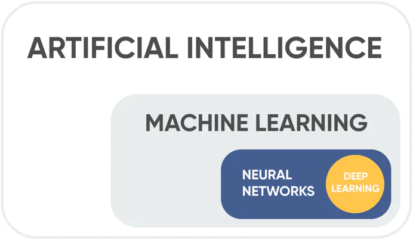
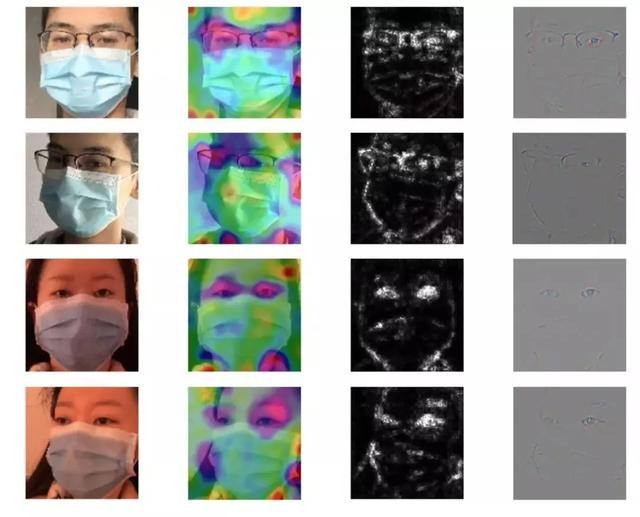
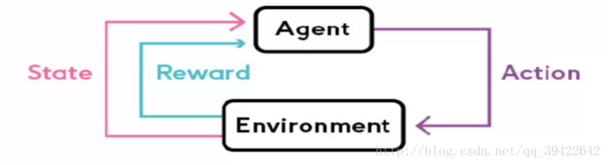

# 周建发 2017141463170 第三次作业

## 1.人工智能、机器学习、深度学习的异同。

就包含的范围而言，人工智能 > 机器学习 > 深度学习。

1956年，几个计算机科学家相聚在达特茅斯会议，提出了“人工智能”的概念，梦想着用当时刚刚出现的计算机来构造复杂的、拥有与人类智慧同样本质特性的机器。

人工智能的研究领域也在不断扩大，下图展示了人工智能研究的各个分支，包括专家系统、机器学习、进化计算、模糊逻辑、计算机视觉、自然语言处理、推荐系统等。

### 机器学习：一种实现人工智能的方法

机器学习最基本的做法，是使用算法来解析数据、从中学习，然后对真实世界中的事件做出决策和预测。与传统的为解决特定任务、硬编码的软件程序不同，机器学习是用大量的数据来“训练”，通过各种算法从数据中学习如何完成任务。

通常，有3种类型的学习算法：

​	1，监督机器学习算法用于进行预测。此外，该算法搜索分配给数据点的值标签内的模式。

​	2，无监督机器学习算法：没有标签与数据点相关联。这些ML算法将数据组织成一组簇。此外，它需要描述其结构，使复杂的数据看起来简单，有条理，便于分析。

​	3，增强机器学习算法：我们使用这些算法来选择动作。此外，我们可以看到它基于每个数据点。一段时间后，算法改变其策略以更好地学习。

### 深度学习：一种实现机器学习的技术

深度学习本来并不是一种独立的学习方法，其本身也会用到有监督和无监督的学习方法来训练深度神经网络。但由于近几年该领域发展迅猛，一些特有的学习手段相继被提出（如残差网络），因此越来越多的人将其单独看作一种学习的方法。

深度学习(Deep learning)是通过构建具有很多隐层的机器学习模型和海量的训练数据，来学习更有用的特征，从而最终提升分类或预测的准确性。因此，“深度模型”是手段，“特征学习”是目的。区别于传统的浅层学习，深度学习的不同在于：

+   1）强调了模型结构的深度，通常有5层、6层，甚至10多层的隐层节点；
+   2）明确突出了特征学习的重要性，也就是说，通过逐层特征变换，将样本在原空间的特征表示变换到一个新特征空间，从而使分类或预测更加容易。与人工规则构造特征的方法相比，利用大数据来学习特征，更能够刻画数据的丰富内在信息。

## 2.介绍三个以上深度学习应用实例。

### a. 戴口罩情况下的人脸识别

**佩戴口罩的人脸中眼睛成为了人脸识别的关键信息，基于口罩的人脸识别采用眼部关键点和注意力机制相结合的方法来增强眼部特征，眼部特征图与整体人脸特征图的多级融合，充分挖掘人脸的有效信息，提升模型在口罩遮挡情况下的表现**。有利于在疫情期间进行监控人群。同时有的地方还加上的红外温度感应装置，能够无接触的进行体温测量。

### b. 语音识别

语音识别是一门交叉学科。 语音识别技术所涉及的领域包括：信号处理、模式识别、概率论和信息论、发声机理和听觉机理、人工智能等等。与机器进行语音交流，让机器明白你说什么，这是人们长期以来梦寐以求的事情，如今人工智能将这一理想变为现实，并带它走入了我们日常的生活。

### c. 无人汽车

无人驾驶汽车是智能汽车的一种，也称为轮式移动机器人，主要依靠车内的以计算机系统为主的智能驾驶仪来实现无人驾驶的目标。从20世纪70年代开始，美国、英国、德国等发达国家开始进行无人驾驶汽车的研究，在可行性和实用化方面都取得了突破性的进展。

中国从20世纪80年代开始进行无人驾驶汽车的研究，国防科技大学在1992年成功研制出中国第一辆真正意义上的无人驾驶汽车。2005年，首辆城市无人驾驶汽车在上海交通大学研制成功。世界上最先进的无人驾驶汽车已经测试行驶近五十万公里，其中最后八万公里是在没有任何人为安全干预措施下完成的。

事实上无人驾驶目前还处于探索阶段，就我所了解到的而言，目前大多数是应用人工智能实现辅助驾驶技术，比如特斯拉，宝马等。

## 3.监督学习与非监督学习的异同。

### 监督学习

不仅把训练数据丢给计算机，而且还把分类的结果（数据具有的标签）也一并丢给计算机分析。
计算机进行学习之后，再丢给它新的未知的数据，它也能计算出该数据导致各种结果的概率，给你一个最接近正确的结果。
由于计算机在学习的过程中不仅有训练数据，而且有训练结果（标签），因此训练的效果通常不错。

### 无监督学习

只给计算机训练数据，不给结果（标签），因此计算机无法准确地知道哪些数据具有哪些标签，只能凭借强大的计算能力分析数据的特征，从而得到一定的成果，通常是得到一些集合，集合内的数据在某些特征上相同或相似。

## 4.强化学习的基本原理。

强化学习是机器学习的一个分支，强调如何基于环境行动，以取得最大化的预期利益，其灵感来源于心理学中的行为主义理论，即有机体如何在环境的奖励或惩罚刺激下，逐步形成对刺激的预期，产生能最大化利益的习惯性行为。

如图所示，Agent表示机器人，Enviroment表示环境，强化学习其实是在环境和机器人之间的互动，环境通过对机器人产生奖励，刺激机器人产生下一个action，如此不断进行下去。这与条件反射非常像。

强化学习的任务对应一个四元组：
$$
E = <X,A,P,R>
$$
​	X：当前状态
​	A：可采取的动作总体集合
​	P：各个转移状态的概率值
​	R：奖赏函数

整体的过程是，对于当前状态X，从动作集合A中选择一个动作，作用在X上，使得X按照概率转移函数P转移到另外一种状态，然后环境根据奖赏函数R对动作进行反馈。

强化学习在某种意义上可看作具有延迟标记信息的监督学习，它与监督学习不同，监督学习每个样本会有对应的标签，强化学习没有标签，而是执行完动作之后，通过反馈来判断执行动作是否正确。