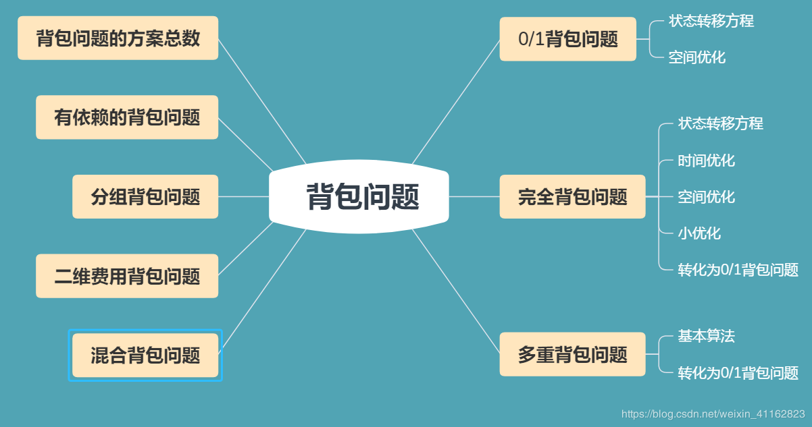

# 背包问题汇总

**什么是背包问题：**背包问题指这样一类问题，题意往往可以抽象成：给定一组物品，每种物品都有自己的重量和价格，在限定的总重量内，我们如何选择，才能使得物品的总价格最高。

背包问题的种类：就ACM或者其它算法竞赛而言，背包问题可以分为8种类型，其中最基础的是0/1背包问题。作为动态规划的典型问题，其状态转移方程往往需要认真理解并能自行推出。这八种问题分别为：0/1背包问题、完全背包问题、多重背包问题、混合三种背包问题、二维费用背包问题、分组背包问题、有依赖的背包问题、求背包问题的方案总数。



### 0/1背包问题

**问题描述：**有 N 件物品和一个容量为 V 的背包。第 i 件物品的费用（即体积，下同）是 w[i]，价值是 val[i]。求解将哪些物品装入背包可使这些物品的费用总和不超过背包容量，且价值总和最大。

**解题思路**：用动态规划的思路，阶段就是 “物品的件数” ，状态就是 “背包剩下的容量” ，那么很显然 $f[i,v]$ 就设为从前 i 件物品中选择放入容量为 v 的背包最大的价值。那么状态转移方程为：
$$
f[i][v]=max\{f[i-1][v], f[i-1][v-w[i]]+val[i]\}
$$
这个方程可以如下解释：只考虑子问题 “将前 i 个物品放入容量为 v 的背包中的最大价值” 那么考虑如果不放入 i ，最大价值就和 i 无关，就是 $f[ i - 1 ][ v ] $ , 如果放入第 i 个物品，价值就是 $ f[ i - 1][ v - w[i] ] + val[ i ]$，我们只需取最大值即可。

**空间优化**：上述状态表示，我们需要用二维数组，但事实上我们只需要一维的滚动数组就可以递推出最终答案。考虑到用$f[ v ]$ 来保存每层递归的值，由于我们求 $f[ i ][ v ] $ 的时候需要用到的是$f[ i-1 ][ v] $和$ f[ i-1 ][v - w[i] ] $于是可以知道，只要我们在求$f[ v ]$时不覆盖$f[ v - w[i] ]​$，那么就可以不断递推至所求答案。所以我们采取倒序循环，即v = m（m为背包总容积）伪代码如下：

```java
　　for i = 1..N

　　　for v = V..0

　　　　　f[ v ] = max{ f[ v ],f[ v-w[i] ]+val[ i ] };
```


<https://blog.csdn.net/weixin_41162823/article/details/87878853?depth_1-utm_source=distribute.pc_relevant.none-task-blog-BlogCommendFromBaidu-1&utm_source=distribute.pc_relevant.none-task-blog-BlogCommendFromBaidu-1>

