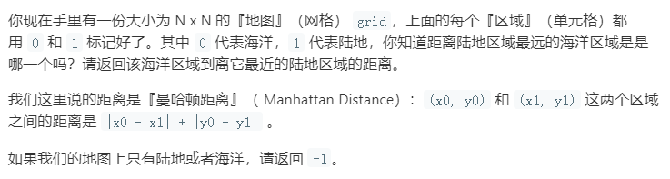

#### [1162. 地图分析](https://leetcode-cn.com/problems/as-far-from-land-as-possible/)



```java
// 使用广度优先遍历
class Solution {
   public int maxDistance(int[][] grid) {
       int N = grid.length;
       Queue<int[]> queue = new LinkedList<>();
       // 找到所有陆地，并加入到队列中
       for(int i = 0; i < N; i++){
           for(int j = 0; j < N; j++){
               if(grid[i][j] == 1) queue.offer(new int[]{i,j});
           }
       }

    int distance = -1;

    // 判断是否全为陆地 或海洋
    if(queue.size() == 0 || queue.size() == N*N) return distance;

    // 开始广度优先遍历
    while(!queue.isEmpty()){
        distance++;
        int size = queue.size();
        for(int i = 0; i < size; i++){
            int[] temp = queue.poll();// 出队一个陆地
            // 然后判断前后左右 是否为海洋，如果是则标记，且加入队列
            int row = temp[0];
            int col = temp[1];
            // 上
            if(row-1 >= 0 && grid[row-1][col] == 0){
                grid[row-1][col] --;
                queue.offer(new int[]{row-1,col});
            }
            // 下
            if(row+1 < N && grid[row+1][col] == 0){
                grid[row+1][col] --;
                queue.offer(new int[]{row+1,col});
            }
            // 左
            if(col -1 >=0 && grid[row][col-1] == 0){
                grid[row][col-1] --;
                queue.offer(new int[]{row,col - 1});
            }
            // 右
            if(col +1 < N && grid[row][col+1] == 0){
                grid[row][col+1] --;
                queue.offer(new int[]{row,col + 1});
            }
        }
    }
    return distance;
   }
}

// 动态规划   -- 非常快
class Solution {
    //利用动态规划的方法来解决问题
    public int maxDistance(int[][] grid) {
        int [][]dp=new int [grid.length][grid[0].length];
        int i, j;
        int res = 0;//返回值res
        for(i=0;i<grid.length;i++)
            for(j=0;j<grid.length;j++)
                dp[i][j]=400;
        //定义初始值为400，这样之后取最小值就可以当作是该点到陆地的最近距离

        for(i=0;i<grid.length;i++)
            for(j=0;j<grid[0].length;j++)
            {
                if(grid[i][j]==1)
                    dp[i][j]=0;
                if(i<grid.length-1)
                    dp[i+1][j]=Math.min(dp[i][j]+1,dp[i+1][j]);
                if(j<grid[0].length-1)
                    dp[i][j+1]=Math.min(dp[i][j]+1,dp[i][j+1]);
            }
        
        for(i=grid.length-1;i>=0;i--)
            for(j=grid[0].length-1;j>=0;j--)
            {
                if(i>=1)
                    dp[i-1][j]=Math.min(dp[i-1][j],dp[i][j]+1);
                if(j>=1)
                    dp[i][j-1]=Math.min(dp[i][j]+1,dp[i][j-1]);
            }

        for(i=0;i<grid.length;i++)
            for(j=0;j<grid[0].length;j++)
                res=Math.max(res,dp[i][j]);
        //如果返回值是0代表所有格子都被陆地占据，此时依题意应当返回-1
        //如果返回值是400标明所有格子都是海洋，也要返回-1
        if(res==0)
            return -1;
        else if(res==400)
            return -1;
        return res;
    }
}
```

