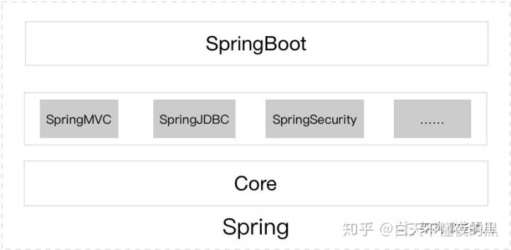

# 面试问题汇总


# Spring相关

1.  spring 相比new的好处？（ioc的思想最核心的地方在于，资源不由使用资源的双方管理，而由不使用资源的第三方管理，这可以带来很多好处。第一，资源集中管理，实现资源的可配置和易管理。第二，降低了使用资源双方的依赖程度，也就是我们说的耦合度。适合扩展性的周期长的项目，很小的项目使用spring反而会增加开发的负担。）

2.  spring MVC 提到了DispatchServlet ,问当用户有多个页面请求时，比如请求美团、京东、页面时，是如何区分的？（处理器映射器和处理器适配器，）映射如何实现（答案见下图）

3.  Aop的理解

4.  依赖注入理解

5.  Spring产品关系

    

    SpringCore主要有IOC 和 AOP两大特性，在此基础上衍生出了SpringMVC，SpringJDBC等组件，SpringBoot又依附于这两层。所以其依赖关系: Spring > SpringMVC > SpringBoot。

    Spring Cloud ，虽然它带有“Cloud”，但是它并不是针对云计算的解决方案，而是在 Spring Boot 基础上构建的，用于快速构建分布式系统的通用模式的工具集。

    使用 Spring Cloud 开发的应用程序非常适合在 Docker 或者 PaaS 上部署，所以又叫云原生应用。云原生可以简单理解为面向云环境的软件架构。

    **Spring Cloud是一系列框架的有序集合。它利用 Spring Boot的开发便利性巧妙地简化了分布式系统基础设施的开发,如服务发现注册、配置中心、消息总线、负载均衡、熔断器、数据监控等,都可以用 Spring Boot的开发风格做到一键启动和部署。**Spring并没有重复制造轮子,它只是将目前各家公司开发的比较成熟、经得起实际考验的服务框架组合起来,通过 Spring Boot风格进行再封装屏蔽掉了复杂的配置和实现原理,基于约定大于配置原则，最终给开发者留出了一套简单易懂、易部署和易维护的分布式系统开发工具包。

    

## JVM 相关

1.  效率：复制算法>标记/整理算法>标记/清除算法（此处的效率只是简单的对比时间复杂度，实际情况不一定如此）。

    内存整齐度：复制算法=标记/整理算法>标记/清除算法。    
    内存利用率：标记/整理算法=标记/清除算法>复制算法。

2.  内存溢出（除了程序计数器都会有内存溢出）和内存泄漏（不再引用的对象占用内存空间，面试官提示我现在的引用计数法和可达性分析法可以做到无内存泄漏,大概是这个意思吧），

3.  Java 8 默认JVM信息

    ```bash
    C:\Users\Administrator>java -XX:+PrintCommandLineFlags -version
    -XX:InitialHeapSize=132172352 
    -XX:MaxHeapSize=2114757632 
    -XX:+PrintCommandLineFlags 
    -XX:+UseCompressedClassPointers 
    -XX:+UseCompressedOops 
    -XX:-UseLargePagesIndividualAllocation 
    -XX:+UseParallelGC
    java version "1.8.0_241"
    Java(TM) SE Runtime Environment (build 1.8.0_241-b07)
    Java HotSpot(TM) 64-Bit Server VM (build 25.241-b07, mixed mode)
    
    C:\Users\Administrator>java -XX:+PrintGCDetails -version
    java version "1.8.0_241"
    Java(TM) SE Runtime Environment (build 1.8.0_241-b07)
    Java HotSpot(TM) 64-Bit Server VM (build 25.241-b07, mixed mode)
    Heap
     PSYoungGen      total 38400K, used 2678K 
      eden space 33280K, 8% used 
      from space 5120K, 0% used 
      to   space 5120K, 0% used 
     ParOldGen       total 87552K, used 0K 
      object space 87552K, 0% used
     Metaspace       used 2372K, capacity 4480K, committed 4480K, reserved 1056768K
      class space    used 255K, capacity 384K, committed 384K, reserved 1048576K
    ```

    

## 数据结构

1.  快速排序
2.  并归排序


      在重写equals方法的时候，需要遵守下面的通用约定：
           1、自反性。
               对于任意的引用值x，x.equals(x)一定为true。
           2、对称性。
               对于任意的引用值x和y，当且仅当y.equals(x)返回true时，x.equals(y)也一定返回true。
           3、传递性。
               对于任意的引用值x、y和z，如果x.equals(y)返回true，并且y.equals(z)也返回true，那么x.equals(z)也一定返回true。
           4、一致性。
               对于任意的引用值x和y，如果用于equals比较的对象没有被修改的话，那么，对此调用x.equals(y)要么一致地返回true，要么一致的返回false。
           5、对于任意的非空引用值x，x.equals(null)一定返回false。
     重写hashCode方法的大致方式：
            a、把某个非零常数值，比如说17（最好是素数），保存在一个叫result的int类型的变量中。
            b、对于对象中每一个关键域f（值equals方法中考虑的每一个域），完成一些步骤：
                1、为该域计算int类型的散列吗c：
                    1）、如果该域是boolean类型，则计算（f？0:1）。
                    2)、如果该域是byte、char、short或者int类型，则计算（int）f。
                    3）、如果该域是float类型，则计算Float.floatToIntBits(f)。
                    4）、如果该域是long类型，则计算（int）（f ^ (f>>>32)）。
                    5）、如果该域是double类型，则计算Double.doubleToLongBits(f)得到一个long类型的值，然后按照步骤4，对该long型值计算散列值。
                    6）、如果该域是一个对象引用，并且该类的equals方法通过递归调用equals的方式来比较这个域，则同样对这个域递归调用hashCode。如果要求一个更为复杂的比较，则为这个域计算一个“规范表示”，然后针对这个范式表示调用hashCode。如果这个域的值为null，则返回0（或者其他某个常数）
                    7）、如果该域是一个数组，则把每一个元素当做单独的域来处理。也就是说，递归地应用上述规则，对每个重要的元素计算一个散列码，然后根据步骤下面的做法把这些散列值组合起来。
                2、按照下面的公式，把步骤1中计算得到的散列码C组合到result中：
                    result = 31*result+c。
            c、返回result。
            d、写完hashCode方法之后，问自己“是否相等的实例具有相等的散列码”。如果不是的话，找出原因，并修改。
            可以通过org.apache.commons.lang.builder.HashCodeBuilder这个工具类来方便的重写hashCode方法。